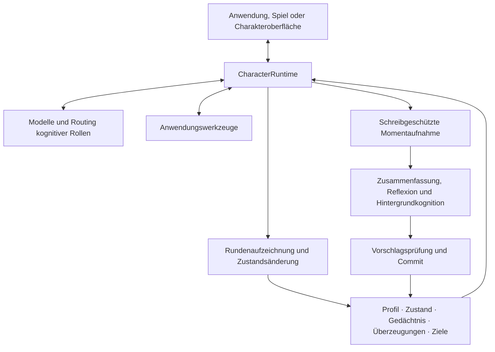

<p align="center">
  
</p>

<h1 align="center">AI Character Engine</h1>

<p align="center"><strong>Ein Python-SDK für KI-Charaktere mit Gedächtnis, Werkzeugen und fortlaufenden Gesprächen.</strong></p>

<p align="center">
  <a href="pyproject.toml"></a>
  <a href="LICENSE"></a>
  <a href="docs/getting-started.md"></a>
  <a href="https://github.com/weryk153/ai-character-engine/actions/workflows/ci.yml"></a>
</p>

<blockquote>
  <p align="center"><strong>Entwickle KI-Begleiter, NPCs und virtuelle Assistenten mit einer gemeinsamen Charakter-Runtime.</strong></p>
</blockquote>

<p align="center">
  <strong><a href="README.md">English</a> &nbsp;|&nbsp; <a href="README.zh-TW.md">繁體中文</a> &nbsp;|&nbsp; <a href="README.zh-CN.md">简体中文</a> &nbsp;|&nbsp; <a href="README.ja.md">日本語</a> &nbsp;|&nbsp; <a href="README.ko.md">한국어</a><br />
  <a href="README.es.md">Español</a> &nbsp;|&nbsp; <a href="README.fr.md">Français</a> &nbsp;|&nbsp; <a href="README.de.md">Deutsch</a> &nbsp;|&nbsp; <a href="README.pt-BR.md">Português (Brasil)</a></strong>
</p>

<p align="center">
  <strong><a href="docs/README.md">Dokumentation</a> &nbsp;|&nbsp; <a href="docs/getting-started.md">Installation</a> &nbsp;|&nbsp; <a href="examples/README.md">Beispiele</a> &nbsp;|&nbsp; <a href="docs/architecture.md">Architektur</a> &nbsp;|&nbsp; <a href="skills/ai-character-engine/SKILL.md">Agent Skill</a></strong>
</p>

---

## Über das Projekt

Mit AI Character Engine entwickelst du KI-Begleiter, NPCs und virtuelle Assistenten. Gib ihnen eine Persönlichkeit, lass sie sich an Interaktionen erinnern und offene Aufgaben verfolgen. Über Werkzeuge können sie in deiner Anwendung handeln.

Die Engine verwaltet Gespräche, Langzeitgedächtnis, Emotionen, Beziehungen, Reflexionen, Überzeugungen und Ziele. Das Modell erzeugt Antworten. Charakterdaten liegen außerhalb des Modells: Du kannst sie prüfen, korrigieren, speichern und nach einem Modellwechsel weiterverwenden.

Beginne mit Textchat oder integriere die Engine in einen Desktop-Charakter, eine Sprachoberfläche oder ein Spiel. Der Kern ist unabhängig von einem bestimmten Modell oder Renderer. Der VRM-Adapter ist optional. Unterstützt Linux, macOS und Windows mit Python 3.11–3.13.

## ✨ Funktionen

### 🧠 Gedächtnis und Charakterzustand

- **Langzeitgedächtnis:** Speichert relevante Erlebnisse und ruft zum aktuellen Thema passende Erinnerungen ab. Mit Korrektur, Konsolidierung und Vergessen.
- **Reflexion und Überzeugungen:** Ordnet Deutungen vergangener Ereignisse und behält ihre Belege. Unzureichende und widersprüchliche Belege werden gesondert behandelt; Modellwiederholungen erzeugen keine Tatsachen.
- **Emotionen und Beziehungen:** Verwaltet Emotion, Energie, Vertrauen, Zuneigung und Beziehungsphase. Deine Regeln bestimmen, wie sie sich ändern.
- **Gespeicherte Sitzungen:** Speichert Gespräche und Beziehungsdaten und stellt sie wieder her, für den nächsten Besuch.

### 🎯 Ziele und Handlungen

- **Fortbestehende Ziele:** Hält Aufgaben, Motivation sowie aktiven, blockierten, pausierten oder abgeschlossenen Status fest, auch nach einem Themenwechsel.
- **Werkzeugaufrufe:** Registriere Datenabfragen, Spielzustandsabfragen oder Anwendungsaktionen. Implementierung und Berechtigungen liegen bei deiner App.
- **Proaktive Interaktion:** Der Autonomie-Host bietet Auslöser und Zeitplanung. Erlaubte Aktionen und Ausführungszeitpunkte konfigurierst du.

### ⚡ Hintergrundkognition und mehrere Modelle

- **Sprechen und Erfahrungen verarbeiten:** Gesprächsrunden im Vordergrund, Zusammenfassungen und Reflexionen im Hintergrund, mit Parallelitätsgrenzen, Zeitlimits und Abbruch.
- **Modelle nach Rolle:** Dialog, Zusammenfassung, Reflexion und Bildverarbeitung können ein Modell teilen oder verschiedene Endpunkte mit konfiguriertem Fallback nutzen.
- **Spezialisten:** Ein optionaler Ablauf aus Planer, Spezialisten und Prüfer verteilt eine begrenzte Aufgabe und sammelt Ergebnisse.

### 🌍 Mehrere Charaktere und Weltinteraktion

- **Eigene Erinnerungen und Sichtweisen:** Jeder Charakter behält seinen Zustand und seine Kognitionsdaten. Die Kommunikation erfolgt durch ausdrückliche Nachrichten.
- **Beobachtungen nach Charakter:** Wahrnehmungsregeln bestimmen die Empfänger von Weltereignissen. Ein NPC kann beobachten, wie sich eine Tür öffnet, ohne dass alle anderen davon wissen.
- **Deine Welt anbinden:** Schnittstellen für Weltzustand, Ereignisse und Beobachtungen. Bewegung, Physik und Darstellung bleiben beim Host.

### 🎙️ Sprache, Bild und Avatare

- **Live-Eingabe:** Text und normalisierte Bild- oder Audiobeobachtungen an die Live-Runtime übergeben.
- **Sprachgespräche:** Schnittstellen und Abläufe für Erkennung, Streaming-Synthese, Wiedergabe und Unterbrechung. Anbieter und Geräte müssen eingerichtet sein.
- **Mimik und Lippensynchronisation:** Erzeugt Ausdrucks-, Verhaltens- und Mundbewegungssignale für das Charaktermodell des Hosts. Der VRM-Adapter ist optional.

Außerdem enthalten: Ereignis-Traces, Persistenz-Replay, Kognitionsevaluation, HTTP/SSE/WebSocket-Services sowie SFT/LoRA-Werkzeuge für Offline-Training. Die Module sind optional. Starte mit Text und ergänze die benötigten Teile.

## 🏗️ Architektur

`CharacterRuntime` ist der Einstiegspunkt für einen Charakter. Die Runtime baut Kontext auf, ruft Modelle und Werkzeuge auf und zeichnet das Ergebnis auf. Profil, Zustand, Gedächtnis, Überzeugungen und Ziele werden getrennt gespeichert und innerhalb ihrer Kontextbudgets eingebunden.



Hintergrund-Worker arbeiten mit Momentaufnahmen. Herkunft und Revision werden vor dem Commit geprüft, damit eine alte Aufgabe keinen neueren Zustand einfach überschreibt. Modelle, Sprachdienste und Renderer werden über Schnittstellen angebunden; Runtime und Commit-Ablauf koordinieren Schreibzugriffe.

Der [Architekturleitfaden](docs/architecture.md) beschreibt Datenflüsse, Charaktertrennung, Weltwahrnehmung und Erweiterungen.

## 🚀 Schnellstart

Du brauchst **Python 3.11–3.13**.

```sh
git clone https://github.com/weryk153/ai-character-engine.git
cd ai-character-engine
python -m venv .venv
```

Aktiviere die Umgebung mit `source .venv/bin/activate` unter macOS/Linux oder `.venv\Scripts\Activate.ps1` in Windows PowerShell. Danach installieren:

```sh
python -m pip install .
```

Starte einen lokalen OpenAI-kompatiblen Modellserver, etwa LM Studio. Ersetze `your-loaded-model` durch die Kennung des geladenen Modells und passe die URL an. Beide Aufrufe verwenden denselben Charakter; der zweite erhält den vorherigen Austausch.

```python
import asyncio
from ai_character_engine import CharacterProfile, CharacterRuntime
from ai_character_engine.llm.local import OpenAICompatibleChatClient

async def main():
    llm = OpenAICompatibleChatClient(
        base_url="http://127.0.0.1:1234/v1",
        model="your-loaded-model",
    )
    character = CharacterRuntime(
        character=CharacterProfile(
            id="mei", name="Mei",
            description="A friendly companion who gives concise answers.",
        ),
        llm=llm,
    )
    try:
        print((await character.run_turn("Call me Alex.")).text)
        print((await character.run_turn("What name did I ask you to use?")).text)
    finally:
        await llm.client.close()

asyncio.run(main())
```

Das Beispiel nutzt den Gesprächsverlauf. Für die Fortsetzung nach einem Neustart ergänze [Sitzungsspeicherung](examples/session_runtime.py). Langzeitgedächtnis, Reflexion und Ziele werden separat konfiguriert. Siehe [Installationsanleitung](docs/getting-started.md).

Ein Host, der mit einem einzigen Charakter spricht – ein Chatfenster, eine Sprachanwendung, ein Desktop-Avatar –, kann sich diese Konfiguration sparen: [`CharacterCompanion`](docs/companion.md) ist die Engine, in der Gedächtnis, Stimmung, Ziele, Reflexion und Unterbrechung bereits verdrahtet sind, hinter einem einzigen `reply()`. Ihr Kontext wird fortlaufend in das Gespräch geschrieben, sodass der Prompt-Cache eines lokalen Modells von Runde zu Runde nutzbar bleibt. Siehe [`examples/companion_chat.py`](examples/companion_chat.py).

## 🔌 Modelle und Integrationen

- **LLM:** OpenAI Responses und OpenAI-kompatible Chat Completions, darunter kompatible Endpunkte von LM Studio, Ollama und vLLM. Eigene Clients sind ebenfalls möglich. [Provider-Beispiele](examples/README.md).
- **Sprache und Avatare:** Audio-Extras und [VRM-Adapter](packages/renderer-vrm/README.md) nach Bedarf. Paketinstallation lädt keine Modelle herunter und startet keine Dienste.
- **Lokal oder entfernt:** Der Kern verlangt weder Cloud noch API-Schlüssel. Lokale Modelle können lokale Endpunkte nutzen; Anbieter und Werkzeuge bestimmen die Netzwerknutzung.

## 📂 Beispiele und Dokumentation

- [Begleiter-Charakter](examples/companion_chat.py): ein Terminal-Chat mit einem Charakter, der sich merkt, was du erzählst, und sich mit der Zeit verändert, an einem lokalen OpenAI-kompatiblen Endpunkt.
- [Interaktiver Chat](examples/basic_chat.py) / [Werkzeuge](examples/tool_chat.py): Modell und Zugangsdaten in `.env` konfigurieren.
- [Sitzungen](examples/session_runtime.py): Speichern und Wiederherstellen mit temporärem Speicher und Offline-Client.
- [HTTP/SSE/WebSocket](examples/character_service.py): Servicebeispiel für Web und Mobilgeräte, standardmäßig mit Offline-Client. Für den Einsatz Inferenz und Authentifizierung konfigurieren.
- [Autonomy](examples/autonomy_host.py): Auslöser und Lebenszyklus integrieren.
- [Erinnerungskorrektur](tests/scenarios/memory_revision.py), [Reflexion und Überzeugungen](tests/scenarios/reflection_long_term_cognition.py), [Ziele](tests/scenarios/goal_motivation_runtime.py), [Wahrnehmung](tests/scenarios/world_environment.py): ausführbare Regressionsszenarien mit Konfiguration und erwarteten Ergebnissen.

[API-Referenz](docs/api-reference.md) · [Konfiguration](docs/configuration.md) · [Bereitstellung und Betrieb](docs/operations.md) · [Erweiterungen](docs/extensions.md)

## Entwicklung und Lizenz

Aktuelle Version: **1.1.1**. CI prüft Linux/macOS/Windows × Python 3.11/3.12/3.13 sowie API-Kompatibilität, Persistenz-Replay, Fehlerinjektion, Leistung in gleicher Umgebung und Paketinstallation. [CI](https://github.com/weryk153/ai-character-engine/actions/workflows/ci.yml) · [Validierung](VALIDATION.md) · [Kompatibilität](docs/compatibility.md).

Fehlerberichte und Korrekturen sind willkommen; siehe [CONTRIBUTING](CONTRIBUTING.md). Lizenz: [Apache-2.0](LICENSE). Modelle, Stimmen und Assets Dritter behalten ihre eigenen Lizenzen.
