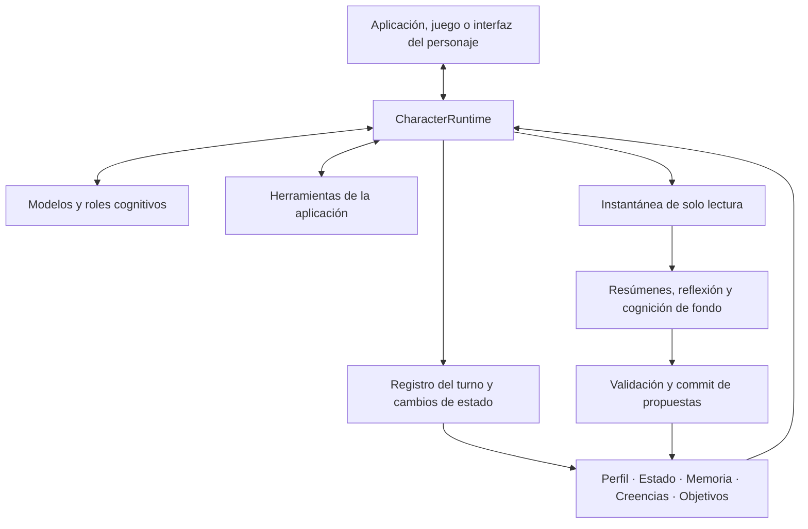

<p align="center">
  
</p>

<h1 align="center">AI Character Engine</h1>

<p align="center"><strong>Un SDK de Python para personajes de IA con memoria, herramientas y conversaciones continuas.</strong></p>

<p align="center">
  <a href="pyproject.toml"></a>
  <a href="LICENSE"></a>
  <a href="docs/getting-started.md"></a>
  <a href="https://github.com/weryk153/ai-character-engine/actions/workflows/ci.yml"></a>
</p>

<blockquote>
  <p align="center"><strong>Crea compañeros de IA, NPCs y asistentes virtuales con un mismo runtime de personajes.</strong></p>
</blockquote>

<p align="center">
  <strong><a href="README.md">English</a> &nbsp;|&nbsp; <a href="README.zh-TW.md">繁體中文</a> &nbsp;|&nbsp; <a href="README.zh-CN.md">简体中文</a> &nbsp;|&nbsp; <a href="README.ja.md">日本語</a> &nbsp;|&nbsp; <a href="README.ko.md">한국어</a><br />
  <a href="README.es.md">Español</a> &nbsp;|&nbsp; <a href="README.fr.md">Français</a> &nbsp;|&nbsp; <a href="README.de.md">Deutsch</a> &nbsp;|&nbsp; <a href="README.pt-BR.md">Português (Brasil)</a></strong>
</p>

<p align="center">
  <strong><a href="docs/README.md">Documentación</a> &nbsp;|&nbsp; <a href="docs/getting-started.md">Instalación</a> &nbsp;|&nbsp; <a href="examples/README.md">Ejemplos</a> &nbsp;|&nbsp; <a href="docs/architecture.md">Arquitectura</a> &nbsp;|&nbsp; <a href="skills/ai-character-engine/SKILL.md">Agent Skill</a></strong>
</p>

---

## Acerca del proyecto

AI Character Engine permite crear compañeros de IA, NPCs y asistentes virtuales. Define su personalidad, haz que recuerden interacciones y tareas pendientes, y conecta herramientas para que actúen dentro de tu aplicación.

El motor gestiona conversaciones, memoria a largo plazo, emociones, relaciones, reflexiones, creencias y objetivos. El modelo genera respuestas. Los datos del personaje viven fuera del modelo: puedes inspeccionarlos, corregirlos, guardarlos y seguir usándolos cuando cambies de modelo.

Empieza con chat de texto o intégralo en un personaje de escritorio, una interfaz de voz o un juego. El núcleo no depende de un modelo ni renderer concreto. El adaptador VRM es opcional. Compatible con Linux, macOS y Windows, con Python 3.11–3.13.

## ✨ Funciones

### 🧠 Memoria y estado del personaje

- **Memoria a largo plazo:** Guarda momentos útiles y recupera recuerdos relacionados con el tema actual. Incluye corrección, consolidación y olvido.
- **Reflexión y creencias:** Organiza interpretaciones de eventos pasados y conserva sus evidencias. La falta de respaldo y las contradicciones tienen tratamiento propio; repetir una respuesta no la convierte en un hecho.
- **Emociones y relaciones:** Gestiona emoción, energía, confianza, afinidad y etapa de relación. Tus políticas deciden cómo cambian.
- **Sesiones guardadas:** Guarda y restaura conversaciones y relaciones para continuar en la siguiente visita.

### 🎯 Objetivos y acciones

- **Objetivos continuos:** Conserva tareas, motivación y estados activo, bloqueado, pausado o completado, incluso al cambiar de tema.
- **Herramientas:** Registra consultas de datos, estado del juego o acciones de la aplicación. Tu aplicación controla implementación y permisos.
- **Interacción proactiva:** El host de autonomía ofrece activadores y programación. Configura las acciones permitidas y cuándo ejecutarlas.

### ⚡ Cognición en segundo plano y varios modelos

- **Conversar mientras se procesan experiencias:** Turnos en primer plano y resúmenes o reflexiones en segundo plano, con límites de concurrencia, tiempos máximos y cancelación.
- **Modelos por función:** Diálogo, resumen, reflexión y visión pueden compartir modelo o usar distintos endpoints con fallback configurado.
- **Especialistas:** Un flujo opcional de planificador, especialistas y verificador reparte una tarea acotada y recoge los resultados.

### 🌍 Varios personajes y un mundo compartido

- **Memorias y perspectivas propias:** Cada personaje mantiene su estado y datos cognitivos; se comunican mediante mensajes explícitos.
- **Observaciones por personaje:** Las reglas de percepción deciden quién recibe un evento. Un NPC puede ver abrirse una puerta sin que todos los demás lo sepan.
- **Conecta tu mundo:** Interfaces para estado del mundo, eventos y observaciones. Movimiento, física y renderizado permanecen en el host.

### 🎙️ Voz, visión y avatares

- **Entrada en vivo:** Envía texto y observaciones visuales o de audio normalizadas al live runtime.
- **Conversación por voz:** Interfaces y flujos para reconocimiento, síntesis en streaming, reproducción e interrupciones. Requieren proveedores y dispositivos configurados.
- **Expresiones y sincronización labial:** Genera señales de expresión, comportamiento y labios para el modelo de tu aplicación. El adaptador VRM es una conexión opcional.

También incluye trazas, replay de persistencia, evaluación cognitiva, servicios HTTP/SSE/WebSocket y herramientas de entrenamiento offline SFT/LoRA. Son módulos opcionales: empieza por texto y añade lo necesario.

## 🏗️ Arquitectura

`CharacterRuntime` es la entrada de un personaje. Compone el contexto, llama a modelos y herramientas y registra el resultado del turno. Perfil, estado, memoria, creencias y objetivos se guardan por separado y entran en sus presupuestos de contexto.



Los workers usan instantáneas. Antes del commit se comprueban procedencia y revisión, para evitar que una tarea antigua sobrescriba un estado nuevo. Modelos, servicios de voz y renderers se conectan mediante interfaces; el runtime y el flujo de commit coordinan las escrituras.

La [guía de arquitectura](docs/architecture.md) explica los flujos, el aislamiento de personajes, la percepción y las extensiones.

## 🚀 Inicio rápido

Necesitas **Python 3.11–3.13**.

```sh
git clone https://github.com/weryk153/ai-character-engine.git
cd ai-character-engine
python -m venv .venv
```

Activa el entorno con `source .venv/bin/activate` en macOS/Linux o `.venv\Scripts\Activate.ps1` en Windows PowerShell e instala:

```sh
python -m pip install .
```

Inicia un servidor local compatible con OpenAI, por ejemplo LM Studio. Cambia `your-loaded-model` por el identificador del modelo cargado y ajusta la URL. Ambas llamadas usan el mismo personaje; la segunda recibe el intercambio anterior.

```python
import asyncio
from ai_character_engine import CharacterProfile, CharacterRuntime
from ai_character_engine.llm.local import OpenAICompatibleChatClient

async def main():
    llm = OpenAICompatibleChatClient(
        base_url="http://127.0.0.1:1234/v1",
        model="your-loaded-model",
    )
    character = CharacterRuntime(
        character=CharacterProfile(
            id="mei", name="Mei",
            description="A friendly companion who gives concise answers.",
        ),
        llm=llm,
    )
    try:
        print((await character.run_turn("Call me Alex.")).text)
        print((await character.run_turn("What name did I ask you to use?")).text)
    finally:
        await llm.client.close()

asyncio.run(main())
```

El ejemplo usa historial de conversación. Para continuar tras reiniciar, añade [sesiones guardadas](examples/session_runtime.py). Memoria a largo plazo, reflexión y objetivos se configuran por separado. Consulta la [guía de instalación](docs/getting-started.md).

Un host que habla con un solo personaje —una ventana de chat, una aplicación de voz, un avatar de escritorio— puede saltarse esa configuración: [`CharacterCompanion`](docs/companion.md) es el motor con memoria, ánimo, objetivos, reflexión e interrupción ya conectados, detrás de un único `reply()`. Su contexto se escribe dentro de la conversación a medida que crece, así que la caché de prompts de un modelo local sigue siendo útil de turno en turno. Ver [`examples/companion_chat.py`](examples/companion_chat.py).

## 🔌 Modelos e integraciones

- **LLM:** OpenAI Responses y Chat Completions compatible con OpenAI, incluidos endpoints compatibles de LM Studio, Ollama y vLLM. También puedes implementar tu client. [Ejemplos](examples/README.md).
- **Voz y avatares:** Extras de audio y [adaptador VRM](packages/renderer-vrm/README.md) opcionales. Instalar paquetes no descarga modelos ni inicia servicios.
- **Local o remoto:** El núcleo no exige nube ni API key. El uso de red depende de los proveedores y herramientas elegidos.

## 📂 Ejemplos y documentación

- [Compañero de personaje](examples/companion_chat.py): un personaje que recuerda, cambia y puede ser interrumpido, en un endpoint local compatible con OpenAI.
- [Chat interactivo](examples/basic_chat.py) / [herramientas](examples/tool_chat.py): configura modelo y credenciales en `.env`.
- [Sesiones](examples/session_runtime.py): guardado y restauración con almacenamiento temporal y client offline.
- [HTTP/SSE/WebSocket](examples/character_service.py): servicio para web o móvil. Usa un client offline; configura inferencia y autenticación para desplegarlo.
- [Autonomy](examples/autonomy_host.py): activadores y ciclo de vida.
- [Revisión de memoria](tests/scenarios/memory_revision.py), [reflexión y creencias](tests/scenarios/reflection_long_term_cognition.py), [objetivos](tests/scenarios/goal_motivation_runtime.py), [percepción](tests/scenarios/world_environment.py): escenarios de regresión ejecutables con configuración y resultados esperados.

[API](docs/api-reference.md) · [Configuración](docs/configuration.md) · [Operación](docs/operations.md) · [Extensiones](docs/extensions.md)

## Desarrollo y licencia

Versión actual: **1.0.0**. CI cubre Linux/macOS/Windows × Python 3.11/3.12/3.13, compatibilidad de API, replay, inyección de fallos, rendimiento en el mismo entorno e instalación de paquetes. [CI](https://github.com/weryk153/ai-character-engine/actions/workflows/ci.yml) · [Validación](VALIDATION.md) · [Compatibilidad](docs/compatibility.md).

Se agradecen incidencias y correcciones; consulta [CONTRIBUTING](CONTRIBUTING.md). Licencia [Apache-2.0](LICENSE). Los modelos, voces y recursos de terceros mantienen sus propias licencias.
