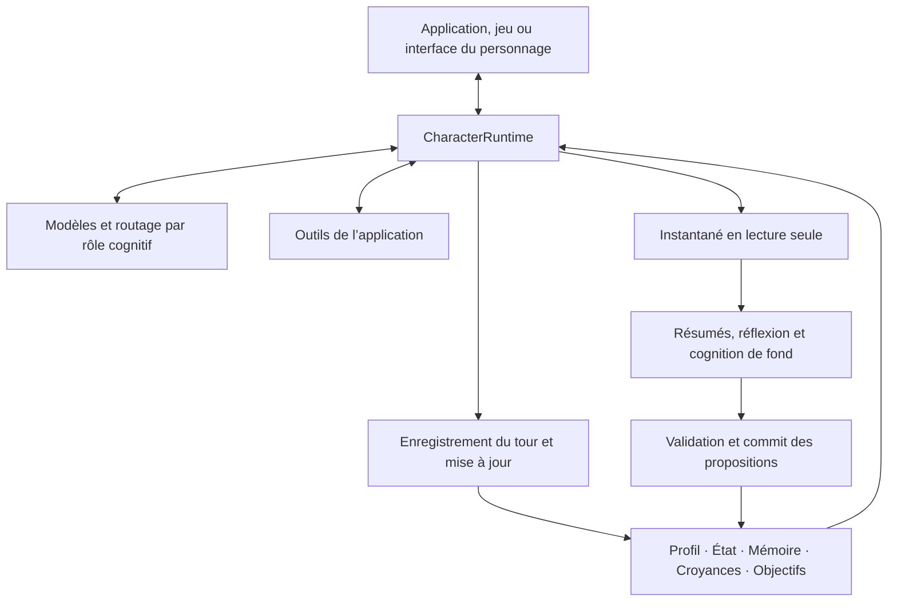

<p align="center">
  
</p>

<h1 align="center">AI Character Engine</h1>

<p align="center"><strong>Un SDK Python pour des personnages IA dotés de mémoire, d’outils et de conversations suivies.</strong></p>

<p align="center">
  <a href="pyproject.toml"></a>
  <a href="LICENSE"></a>
  <a href="docs/getting-started.md"></a>
  <a href="https://github.com/weryk153/ai-character-engine/actions/workflows/ci.yml"></a>
</p>

<blockquote>
  <p align="center"><strong>Créez des compagnons IA, des PNJ et des assistants virtuels avec un même runtime de personnages.</strong></p>
</blockquote>

<p align="center">
  <strong><a href="README.md">English</a> &nbsp;|&nbsp; <a href="README.zh-TW.md">繁體中文</a> &nbsp;|&nbsp; <a href="README.zh-CN.md">简体中文</a> &nbsp;|&nbsp; <a href="README.ja.md">日本語</a> &nbsp;|&nbsp; <a href="README.ko.md">한국어</a><br />
  <a href="README.es.md">Español</a> &nbsp;|&nbsp; <a href="README.fr.md">Français</a> &nbsp;|&nbsp; <a href="README.de.md">Deutsch</a> &nbsp;|&nbsp; <a href="README.pt-BR.md">Português (Brasil)</a></strong>
</p>

<p align="center">
  <strong><a href="docs/README.md">Documentation</a> &nbsp;|&nbsp; <a href="docs/getting-started.md">Installation</a> &nbsp;|&nbsp; <a href="examples/README.md">Exemples</a> &nbsp;|&nbsp; <a href="docs/architecture.md">Architecture</a> &nbsp;|&nbsp; <a href="skills/ai-character-engine/SKILL.md">Agent Skill</a></strong>
</p>

---

## Présentation

AI Character Engine permet de créer des compagnons IA, des PNJ et des assistants virtuels. Donnez-leur une personnalité, faites-leur mémoriser les échanges et suivre les tâches en cours, puis connectez des outils pour qu’ils puissent agir dans votre application.

Le moteur gère conversations, mémoire à long terme, émotions, relations, réflexions, croyances et objectifs. Le modèle génère les réponses. Les données du personnage restent hors du modèle : vous pouvez les consulter, les corriger, les sauvegarder et les réutiliser avec un autre modèle.

Commencez par le texte ou intégrez le moteur à un personnage de bureau, une interface vocale ou un jeu. Le cœur est indépendant d’un modèle ou d’un moteur de rendu particulier. L’adaptateur VRM est facultatif. Compatible Linux, macOS et Windows avec Python 3.11–3.13.

## ✨ Fonctionnalités

### 🧠 Mémoire et état du personnage

- **Mémoire à long terme :** conserve les moments utiles et retrouve les souvenirs pertinents pour le sujet actuel. Correction, consolidation et oubli sont pris en charge.
- **Réflexion et croyances :** organise les interprétations d’événements passés avec leurs preuves. Les éléments insuffisants ou contradictoires sont traités séparément ; une répétition du modèle ne crée pas un fait.
- **Émotions et relations :** suit émotion, énergie, confiance, affinité et stade de relation. Vos politiques déterminent leur évolution.
- **Sessions sauvegardées :** enregistre et restaure conversations et relations pour reprendre lors d’une prochaine visite.

### 🎯 Objectifs et actions

- **Objectifs durables :** conserve tâches, motivation et états actif, bloqué, en pause ou terminé, même après un changement de sujet.
- **Appels d’outils :** enregistrez recherches de données, lectures de l’état du jeu ou actions applicatives. Votre application gère leur implémentation et leurs permissions.
- **Interactions proactives :** l’hôte d’autonomie fournit déclencheurs et planification. Configurez les actions autorisées et leur moment d’exécution.

### ⚡ Cognition en arrière-plan et plusieurs modèles

- **Converser pendant le traitement des expériences :** dialogue au premier plan, résumés et réflexions en arrière-plan, avec limites de concurrence, délais et annulation.
- **Modèles par rôle :** dialogue, résumé, réflexion et vision peuvent partager un modèle ou utiliser plusieurs endpoints avec repli configuré.
- **Spécialistes :** un flux facultatif planificateur, spécialistes et vérificateur répartit une tâche bornée et recueille les résultats.

### 🌍 Plusieurs personnages dans un monde

- **Souvenirs et points de vue distincts :** chaque personnage garde son état et ses données cognitives, et communique par messages explicites.
- **Observations par personnage :** les règles de perception décident qui reçoit un événement. Un PNJ peut voir une porte s’ouvrir sans que tous les autres l’apprennent.
- **Connexion à votre monde :** interfaces d’état du monde, d’événements et d’observations. Déplacements, physique et rendu restent à l’hôte.

### 🎙️ Voix, vision et avatars

- **Entrées en direct :** transmettez texte et observations visuelles ou audio normalisées au live runtime.
- **Conversations vocales :** interfaces et flux pour reconnaissance, synthèse en streaming, lecture et interruptions. Fournisseurs et périphériques doivent être configurés.
- **Expressions et synchronisation labiale :** produit des indications d’expression, de comportement et de mouvement des lèvres à associer au modèle de votre hôte. L’adaptateur VRM est optionnel.

Également inclus : traces, rejeu de persistance, évaluation cognitive, services HTTP/SSE/WebSocket et outils d’entraînement hors ligne SFT/LoRA. Ces modules sont facultatifs : commencez par le texte, puis ajoutez ce qui vous est utile.

## 🏗️ Architecture

`CharacterRuntime` est le point d’entrée d’un personnage. Il compose le contexte, appelle modèles et outils, puis enregistre le résultat du tour. Profil, état, mémoire, croyances et objectifs sont stockés séparément et inclus dans leurs budgets de contexte.



Les workers travaillent sur des instantanés. Provenance et révision sont vérifiées avant commit pour éviter qu’une ancienne tâche écrase un état récent. Modèles, services vocaux et moteurs de rendu se connectent par interfaces ; le runtime et le flux de commit coordonnent les écritures.

Le [guide d’architecture](docs/architecture.md) détaille les flux, l’isolation des personnages, la perception du monde et les extensions.

## 🚀 Démarrage rapide

Il vous faut **Python 3.11–3.13**.

```sh
git clone https://github.com/weryk153/ai-character-engine.git
cd ai-character-engine
python -m venv .venv
```

Activez l’environnement avec `source .venv/bin/activate` sur macOS/Linux ou `.venv\Scripts\Activate.ps1` dans Windows PowerShell, puis installez :

```sh
python -m pip install .
```

Démarrez un serveur local compatible OpenAI, comme LM Studio. Remplacez `your-loaded-model` par l’identifiant du modèle chargé et adaptez l’URL. Les appels utilisent le même personnage ; le second reçoit l’échange précédent.

```python
import asyncio
from ai_character_engine import CharacterProfile, CharacterRuntime
from ai_character_engine.llm.local import OpenAICompatibleChatClient

async def main():
    llm = OpenAICompatibleChatClient(
        base_url="http://127.0.0.1:1234/v1",
        model="your-loaded-model",
    )
    character = CharacterRuntime(
        character=CharacterProfile(
            id="mei", name="Mei",
            description="A friendly companion who gives concise answers.",
        ),
        llm=llm,
    )
    try:
        print((await character.run_turn("Call me Alex.")).text)
        print((await character.run_turn("What name did I ask you to use?")).text)
    finally:
        await llm.client.close()

asyncio.run(main())
```

Cet exemple utilise l’historique conversationnel. Pour poursuivre après redémarrage, ajoutez la [sauvegarde de session](examples/session_runtime.py). Mémoire à long terme, réflexion et objectifs se configurent séparément. Voir le [guide d’installation](docs/getting-started.md).

Un hôte qui parle à un seul personnage — une fenêtre de chat, une application vocale, un avatar de bureau — peut se passer de cette configuration : [`CharacterCompanion`](docs/companion.md) est le moteur avec mémoire, humeur, objectifs, réflexion et interruption déjà câblés, derrière un seul `reply()`. Son contexte s’écrit dans la conversation au fil des tours, de sorte que le cache de prompt d’un modèle local reste utilisable d’un tour à l’autre. Voir [`examples/companion_chat.py`](examples/companion_chat.py).

## 🔌 Modèles et intégrations

- **LLM :** OpenAI Responses et Chat Completions compatible OpenAI, dont les endpoints compatibles de LM Studio, Ollama et vLLM. Vous pouvez aussi écrire votre client. [Exemples de fournisseurs](examples/README.md).
- **Voix et avatars :** extras audio et [adaptateur VRM](packages/renderer-vrm/README.md) selon vos besoins. L’installation ne télécharge pas de modèles et ne lance pas de services.
- **Local ou distant :** le cœur n’exige ni cloud ni clé API. Les modèles locaux peuvent utiliser des endpoints locaux ; les fournisseurs et outils choisis déterminent l’usage du réseau.

## 📂 Exemples et documentation

- [Personnage compagnon](examples/companion_chat.py) : un chat en terminal avec un personnage qui retient ce que vous lui dites et évolue avec le temps, sur un endpoint local compatible OpenAI.
- [Chat interactif](examples/basic_chat.py) / [outils](examples/tool_chat.py) : configurez modèle et identifiants dans `.env`.
- [Sessions](examples/session_runtime.py) : sauvegarde et restauration avec stockage temporaire et client hors ligne.
- [HTTP/SSE/WebSocket](examples/character_service.py) : service web/mobile utilisant un client hors ligne par défaut ; configurez inférence et authentification pour le déploiement.
- [Autonomy](examples/autonomy_host.py) : déclencheurs et cycle de vie.
- [Révision de mémoire](tests/scenarios/memory_revision.py), [réflexion et croyances](tests/scenarios/reflection_long_term_cognition.py), [objectifs](tests/scenarios/goal_motivation_runtime.py), [perception](tests/scenarios/world_environment.py) : scénarios de régression exécutables avec configuration et résultats attendus.

[Référence de l’API](docs/api-reference.md) · [Configuration](docs/configuration.md) · [Déploiement et exploitation](docs/operations.md) · [Extensions](docs/extensions.md)

## Développement et licence

Version actuelle : **1.3.1**. CI couvre Linux/macOS/Windows × Python 3.11/3.12/3.13, compatibilité API, rejeu de la persistance, injection de pannes, performances dans le même environnement et installation des paquets. [CI](https://github.com/weryk153/ai-character-engine/actions/workflows/ci.yml) · [Validation](VALIDATION.md) · [Compatibilité](docs/compatibility.md).

Les signalements et corrections sont les bienvenus ; consultez [CONTRIBUTING](CONTRIBUTING.md). Licence [Apache-2.0](LICENSE). Les modèles, voix et ressources tiers conservent leurs propres licences.
