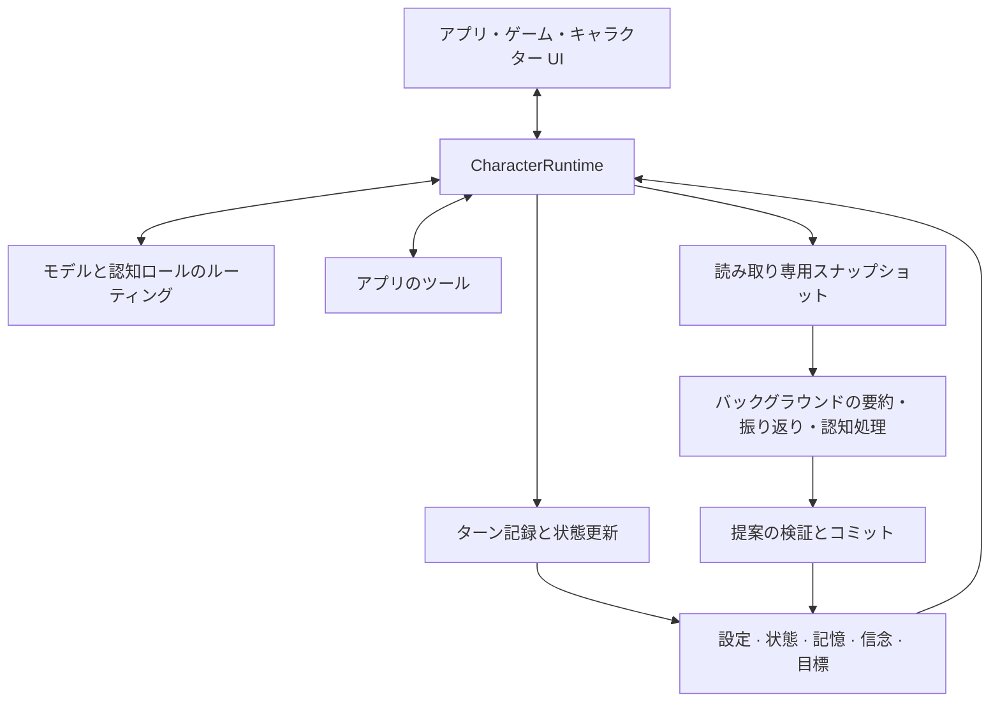

<p align="center">
  
</p>

<h1 align="center">AI Character Engine</h1>

<p align="center"><strong>記憶を持ち、ツールを使い、対話を続ける AI キャラクターのための Python SDK。</strong></p>

<p align="center">
  <a href="pyproject.toml"></a>
  <a href="LICENSE"></a>
  <a href="docs/getting-started.md"></a>
  <a href="https://github.com/weryk153/ai-character-engine/actions/workflows/ci.yml"></a>
</p>

<blockquote>
  <p align="center"><strong>共通のキャラクターランタイムで、AI コンパニオン、ゲーム NPC、バーチャルアシスタントを開発。</strong></p>
</blockquote>

<p align="center">
  <strong><a href="README.md">English</a> &nbsp;|&nbsp; <a href="README.zh-TW.md">繁體中文</a> &nbsp;|&nbsp; <a href="README.zh-CN.md">简体中文</a> &nbsp;|&nbsp; <a href="README.ja.md">日本語</a> &nbsp;|&nbsp; <a href="README.ko.md">한국어</a><br />
  <a href="README.es.md">Español</a> &nbsp;|&nbsp; <a href="README.fr.md">Français</a> &nbsp;|&nbsp; <a href="README.de.md">Deutsch</a> &nbsp;|&nbsp; <a href="README.pt-BR.md">Português (Brasil)</a></strong>
</p>

<p align="center">
  <strong><a href="docs/README.md">ドキュメント</a> &nbsp;|&nbsp; <a href="docs/getting-started.md">インストール</a> &nbsp;|&nbsp; <a href="examples/README.md">サンプル</a> &nbsp;|&nbsp; <a href="docs/architecture.md">アーキテクチャ</a> &nbsp;|&nbsp; <a href="skills/ai-character-engine/SKILL.md">Agent Skill</a></strong>
</p>

---

## プロジェクトについて

AI Character Engine は、AI コンパニオン、ゲームの NPC、バーチャルアシスタントを作るための Python SDK です。キャラクターの性格を設定し、やり取りを記憶させ、未完了の仕事を追跡し、ツールを通してアプリ内で行動できるようにします。

会話と長期記憶、感情と関係性の状態、経験への振り返り、信念、進行中の目標をエンジンが管理し、モデルが応答を生成します。キャラクターのデータはモデルの外に保存するため、確認、修正、永続化が可能です。モデルを変更しても同じデータを使い続けられます。

テキストチャットから始めることも、既存のデスクトップキャラクター、音声 UI、ゲームに組み込むこともできます。コアは特定のモデルやレンダラーに依存しません。VRM アダプターは任意で追加できます。Linux、macOS、Windows、Python 3.11–3.13 に対応しています。

## ✨ 主な機能

### 🧠 記憶とキャラクターの状態

- **長期記憶**：残しておきたい経験を保存し、現在の話題に関連する記憶を検索。訂正、統合、忘却に対応します。
- **振り返りと信念**：過去の出来事から解釈を整理し、根拠も保持。根拠不足や矛盾にはそれぞれ処理があり、モデルの反復だけで事実にはなりません。
- **感情と関係性**：感情、活力、信頼、好感度、関係段階を管理。更新方法はアプリ側のポリシーで設定します。
- **セッション保存**：会話と関係性のデータを保存・復元し、次の訪問で対話を再開できます。

### 🎯 目標と行動

- **継続する目標**：取り組んでいること、動機、進行中・ブロック中・一時停止・完了などの状態を保持。話題が変わっても目標を残せます。
- **ツール呼び出し**：データ検索、ゲーム状態の参照、アプリ操作をツールとして登録。実装と権限はアプリが管理します。
- **能動的な対話**：Autonomy ホストがトリガーとスケジュールの仕組みを提供。実行可能な行動とタイミングは設定が必要です。

### ⚡ バックグラウンド認知と複数モデル

- **会話しながら経験を整理**：フォアグラウンドで対話を処理し、バックグラウンドで要約や振り返りを実行。同時実行数、タイムアウト、キャンセルを設定できます。
- **モデルの分担**：対話、要約、振り返り、視覚を一つのモデルで処理することも、異なるエンドポイントに割り当ててフォールバックを設定することもできます。
- **専門担当の協調**：任意のプランナー・専門担当・検証担当のフローで、範囲を限定したタスクを分担し結果を集めます。

### 🌍 複数キャラクターと世界との接続

- **それぞれの記憶と考え**：キャラクターごとに状態と認知データを保ち、明示的なメッセージでやり取りします。
- **キャラクター別の観察**：知覚ルールで世界イベントの受信者を決定。ドアが開くのを見た NPC だけに、その観察を送ることができます。
- **自分の世界に接続**：世界状態、イベント、観察のインターフェースを提供。移動、物理、描画はホストが担当します。

### 🎙️ 音声・視覚・アバター

- **ライブ入力**：テキストや正規化した映像・音声の観察を live runtime に渡します。
- **音声対話**：認識、ストリーミング合成、再生、割り込みのインターフェースと統合フローを提供。プロバイダーと機器の設定が必要です。
- **表情と口の動き**：表情、振る舞い、リップシンクのキューを出力し、ホスト側のモデルに割り当てます。VRM アダプターも追加できます。

イベント追跡、永続化リプレイ、認知評価、HTTP/SSE/WebSocket サービス、オフライン SFT/LoRA 学習ツールも用意しています。どれも選択式なので、まずテキストキャラクターを動かしてから必要な部分を追加できます。

## 🏗️ アーキテクチャ

`CharacterRuntime` が一体のキャラクターの入口です。文脈の構築、モデルとツールの呼び出し、ターンの記録を担当します。設定、現在の状態、記憶、信念、目標を別々に保持し、それぞれの予算内で文脈に入れます。



バックグラウンドワーカーはスナップショットで処理し、結果の反映前に出典とリビジョンを検査します。古いタスクが新しい状態をそのまま上書きすることを防ぎます。モデル、音声サービス、レンダラーはインターフェース経由で接続し、キャラクターデータの書き込みは runtime とコミット処理が調整します。

[詳細なアーキテクチャ](docs/architecture.md)では、フォアグラウンド・バックグラウンドのデータフロー、キャラクターの分離、世界の知覚、拡張インターフェースを説明しています。

## 🚀 クイックスタート

**Python 3.11–3.13** が必要です。

```sh
git clone https://github.com/weryk153/ai-character-engine.git
cd ai-character-engine
python -m venv .venv
```

macOS/Linux は `source .venv/bin/activate`、Windows PowerShell は `.venv\Scripts\Activate.ps1` で仮想環境を有効化してからインストールします。

```sh
python -m pip install .
```

LM Studio などでローカルの OpenAI 互換モデルサーバーを起動してください。`your-loaded-model` を読み込んだモデル名に置き換え、必要なら URL を変更します。同じキャラクターを二度呼ぶので、二回目には前の会話が渡されます。

```python
import asyncio
from ai_character_engine import CharacterProfile, CharacterRuntime
from ai_character_engine.llm.local import OpenAICompatibleChatClient

async def main():
    llm = OpenAICompatibleChatClient(
        base_url="http://127.0.0.1:1234/v1",
        model="your-loaded-model",
    )
    character = CharacterRuntime(
        character=CharacterProfile(
            id="mei", name="Mei",
            description="A friendly companion who gives concise answers.",
        ),
        llm=llm,
    )
    try:
        print((await character.run_turn("Call me Alex.")).text)
        print((await character.run_turn("What name did I ask you to use?")).text)
    finally:
        await llm.client.close()

asyncio.run(main())
```

この例は会話履歴を使います。再起動後も続けるには [セッション保存・復元](examples/session_runtime.py)を追加してください。長期記憶、振り返り、目標は個別に設定します。手順の詳細は[インストールガイド](docs/getting-started.md)へ。

一人のキャラクターと話すホスト（チャット画面、音声アプリ、デスクトップキャラクター）なら、その設定は省けます。[`CharacterCompanion`](docs/companion.md) は記憶・気分・目標・振り返り・割り込みをあらかじめ組み上げたエンジンで、`reply()` ひとつで使えます。その文脈は会話の中に書き足されていくので、ローカルモデルのプロンプトキャッシュがターンをまたいで効きます。[`examples/companion_chat.py`](examples/companion_chat.py) を参照してください。

## 🔌 モデルと連携

- **LLM**：OpenAI Responses と OpenAI 互換 Chat Completions。互換性のある LM Studio、Ollama、vLLM のエンドポイントや、自作 client を利用できます。[プロバイダー例](examples/README.md)。
- **音声とアバター**：音声 extra や [VRM アダプター](packages/renderer-vrm/README.md) を必要に応じて追加。インストールだけではモデルのダウンロードやサービス起動は行いません。
- **ローカル／リモート**：コアにクラウドサービスや API キーは必須ではありません。ローカルモデルはローカルのエンドポイントを使えます。通信の有無は選択したプロバイダーとツールで決まります。

## 📂 サンプルとドキュメント

- [キャラクターコンパニオン](examples/companion_chat.py)：ターミナルで一人のキャラクターと話せます。話したことを覚え、時間とともに変わっていきます。ローカルの OpenAI 互換エンドポイントで動きます。
- [対話チャット](examples/basic_chat.py)／[ツール呼び出し](examples/tool_chat.py)：`.env` にモデルと認証情報を設定して実行します。
- [セッション](examples/session_runtime.py)：一時保存先とオフライン client で保存・復元を試します。
- [HTTP/SSE/WebSocket](examples/character_service.py)：Web・モバイル向けサービス例。既定はオフライン client なので、運用時はモデルと認証を設定します。
- [Autonomy](examples/autonomy_host.py)：トリガーとライフサイクルの統合例。
- [記憶訂正](tests/scenarios/memory_revision.py)、[振り返りと信念](tests/scenarios/reflection_long_term_cognition.py)、[目標](tests/scenarios/goal_motivation_runtime.py)、[世界の知覚](tests/scenarios/world_environment.py)：設定と期待結果を示す実行可能な回帰シナリオ。

[API リファレンス](docs/api-reference.md) · [設定](docs/configuration.md) · [デプロイと運用](docs/operations.md) · [拡張開発](docs/extensions.md)

## 開発とライセンス

現在のバージョンは **1.1.0**。CI は Linux/macOS/Windows × Python 3.11/3.12/3.13 に加え、API 互換性、永続化リプレイ、障害注入、同一環境での性能、パッケージのインストールを検証します。[CI](https://github.com/weryk153/ai-character-engine/actions/workflows/ci.yml) · [検証](VALIDATION.md) · [互換性](docs/compatibility.md)。

問題報告や修正を歓迎します。参加方法は [CONTRIBUTING](CONTRIBUTING.md) を参照してください。[Apache-2.0](LICENSE) で提供しています。第三者のモデル、音声、素材にはそれぞれのライセンスが適用されます。
