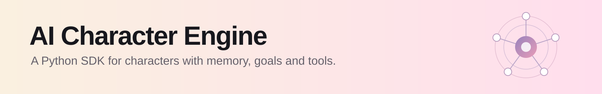
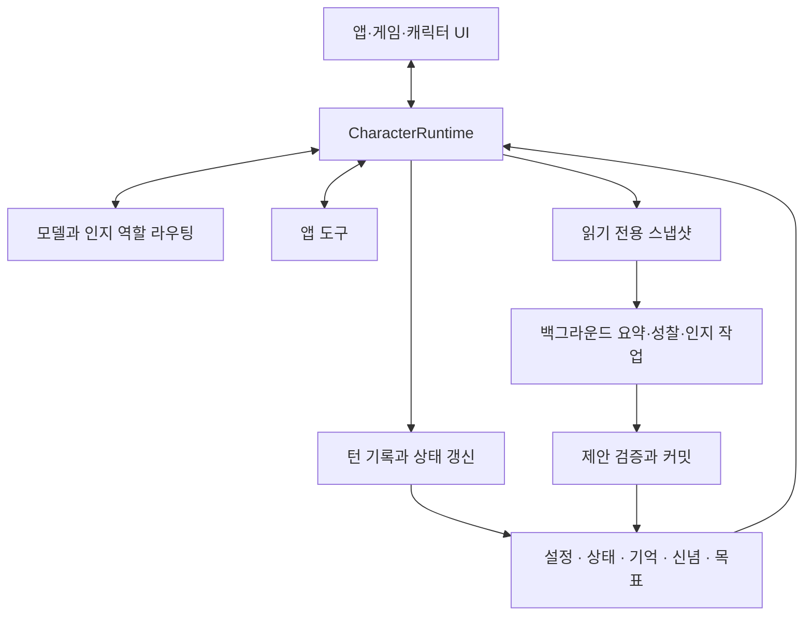

<p align="center">
  
</p>

<h1 align="center">AI Character Engine</h1>

<p align="center"><strong>기억하고, 도구를 사용하고, 대화를 이어가는 AI 캐릭터를 위한 Python SDK.</strong></p>

<p align="center">
  <a href="pyproject.toml"></a>
  <a href="LICENSE"></a>
  <a href="docs/getting-started.md"></a>
  <a href="https://github.com/weryk153/ai-character-engine/actions/workflows/ci.yml"></a>
</p>

<blockquote>
  <p align="center"><strong>하나의 캐릭터 런타임으로 AI 동반자, 게임 NPC, 가상 어시스턴트를 만드세요.</strong></p>
</blockquote>

<p align="center">
  <strong><a href="README.md">English</a> &nbsp;|&nbsp; <a href="README.zh-TW.md">繁體中文</a> &nbsp;|&nbsp; <a href="README.zh-CN.md">简体中文</a> &nbsp;|&nbsp; <a href="README.ja.md">日本語</a> &nbsp;|&nbsp; <a href="README.ko.md">한국어</a><br />
  <a href="README.es.md">Español</a> &nbsp;|&nbsp; <a href="README.fr.md">Français</a> &nbsp;|&nbsp; <a href="README.de.md">Deutsch</a> &nbsp;|&nbsp; <a href="README.pt-BR.md">Português (Brasil)</a></strong>
</p>

<p align="center">
  <strong><a href="docs/README.md">문서</a> &nbsp;|&nbsp; <a href="docs/getting-started.md">설치</a> &nbsp;|&nbsp; <a href="examples/README.md">예제</a> &nbsp;|&nbsp; <a href="docs/architecture.md">아키텍처</a> &nbsp;|&nbsp; <a href="skills/ai-character-engine/SKILL.md">Agent Skill</a></strong>
</p>

---

## 프로젝트 소개

AI Character Engine은 AI 동반자, 게임 NPC, 가상 어시스턴트를 만드는 Python SDK입니다. 캐릭터의 성격을 설정하고, 상호작용을 기억하고, 미완료 작업을 추적하고, 도구를 통해 앱 안에서 행동하도록 만들 수 있습니다.

엔진은 대화와 장기 기억, 감정과 관계 상태, 경험에 대한 성찰, 신념, 진행 중인 목표를 관리합니다. 모델은 응답을 생성합니다. 캐릭터 데이터는 모델 외부에 있어 확인, 수정, 저장할 수 있고, 모델을 바꿔도 계속 사용할 수 있습니다.

텍스트 채팅부터 시작하거나 기존 데스크톱 캐릭터, 음성 UI, 게임에 연결하세요. 코어는 특정 모델이나 렌더러에 묶이지 않으며 VRM 어댑터는 선택적으로 설치합니다. Linux, macOS, Windows와 Python 3.11–3.13을 지원합니다.

## ✨ 주요 기능

### 🧠 기억과 캐릭터 상태

- **장기 기억**: 남길 만한 상호작용을 저장하고 현재 화제와 관련된 기억을 검색합니다. 수정, 통합, 망각을 지원합니다.
- **성찰과 신념**: 과거 사건에서 해석을 만들고 근거를 보존합니다. 부족하거나 충돌하는 근거를 따로 처리하며, 모델이 반복한다고 사실이 되지는 않습니다.
- **감정과 관계**: 감정, 에너지, 신뢰, 호감도, 관계 단계를 관리합니다. 변화 방식은 앱의 정책으로 설정합니다.
- **세션 저장**: 대화와 관계 데이터를 저장하고 복원해 다음 방문에 이어서 이야기할 수 있습니다.

### 🎯 목표와 행동

- **지속적인 목표**: 하는 일, 동기, 진행 중·차단·일시 중지·완료 상태를 추적합니다. 화제가 바뀌어도 목표를 유지할 수 있습니다.
- **도구 호출**: 데이터 검색, 게임 상태 조회, 앱 동작을 도구로 등록합니다. 구현과 권한은 앱에서 관리합니다.
- **능동적인 상호작용**: Autonomy 호스트가 트리거와 일정 기능을 제공합니다. 허용할 행동과 실행 시점은 설정해야 합니다.

### ⚡ 백그라운드 인지와 여러 모델

- **대화하면서 경험 정리**: 포그라운드는 대화 턴을, 백그라운드는 요약과 성찰 등을 처리합니다. 동시 실행 제한, 시간 제한, 취소를 지원합니다.
- **모델 역할 분담**: 대화, 요약, 성찰, 시각이 하나의 모델을 공유하거나 다른 엔드포인트를 사용하고 폴백을 설정할 수 있습니다.
- **전문가 협업**: 선택적 계획자·전문가·검증자 흐름으로 범위가 제한된 작업을 나누고 결과를 모읍니다.

### 🌍 여러 캐릭터와 세계 상호작용

- **각자의 기억과 관점**: 캐릭터별 상태와 인지 데이터를 유지하고 명시적인 메시지로 소통합니다.
- **캐릭터별 관찰**: 지각 규칙이 세계 이벤트의 수신자를 결정합니다. 문이 열리는 것을 본 NPC에만 관찰을 전달할 수 있습니다.
- **게임 세계 연결**: 세계 상태, 이벤트, 관찰 인터페이스를 제공합니다. 이동, 물리, 렌더링은 호스트가 담당합니다.

### 🎙️ 음성·시각·아바타

- **실시간 입력**: 텍스트와 정규화한 시각·음성 관찰을 live runtime에 전달합니다.
- **음성 대화**: 인식, 스트리밍 합성, 재생, 중단의 인터페이스와 통합 흐름을 제공합니다. 프로바이더와 장치를 먼저 설정해야 합니다.
- **표정과 립싱크**: 표정, 행동, 립싱크 큐를 출력해 호스트의 캐릭터 모델에 매핑합니다. VRM 어댑터도 추가할 수 있습니다.

이벤트 추적, 영속성 리플레이, 인지 평가, HTTP/SSE/WebSocket 서비스, 오프라인 SFT/LoRA 학습 도구도 포함합니다. 모두 선택적 모듈이므로 텍스트 캐릭터부터 실행하고 필요한 부분을 추가할 수 있습니다.

## 🏗️ 아키텍처

`CharacterRuntime`이 캐릭터 하나의 진입점입니다. 문맥을 조합하고 모델과 도구를 호출하고 턴 결과를 기록합니다. 설정, 현재 상태, 기억, 신념, 목표를 분리해 저장하고 각 문맥 예산 안에 포함합니다.



백그라운드 워커는 스냅샷으로 작업하며 결과를 반영하기 전에 출처와 리비전을 검사합니다. 오래된 작업이 새로운 캐릭터 상태를 그대로 덮어쓰지 않게 합니다. 모델, 음성 서비스, 렌더러는 인터페이스로 연결하고 데이터 쓰기는 runtime과 커밋 흐름이 조정합니다.

[아키텍처 가이드](docs/architecture.md)에서 포그라운드·백그라운드 흐름, 캐릭터 격리, 세계 지각과 확장 인터페이스를 설명합니다.

## 🚀 빠른 시작

**Python 3.11–3.13**이 필요합니다.

```sh
git clone https://github.com/weryk153/ai-character-engine.git
cd ai-character-engine
python -m venv .venv
```

macOS/Linux에서는 `source .venv/bin/activate`, Windows PowerShell에서는 `.venv\Scripts\Activate.ps1`로 가상 환경을 활성화한 뒤 설치합니다.

```sh
python -m pip install .
```

LM Studio 같은 로컬 OpenAI 호환 모델 서버를 먼저 실행하세요. `your-loaded-model`을 로드한 모델 이름으로 바꾸고 URL도 서버에 맞게 설정합니다. 두 호출은 같은 캐릭터를 사용하므로 두 번째 호출에 이전 대화가 전달됩니다.

```python
import asyncio
from ai_character_engine import CharacterProfile, CharacterRuntime
from ai_character_engine.llm.local import OpenAICompatibleChatClient

async def main():
    llm = OpenAICompatibleChatClient(
        base_url="http://127.0.0.1:1234/v1",
        model="your-loaded-model",
    )
    character = CharacterRuntime(
        character=CharacterProfile(
            id="mei", name="Mei",
            description="A friendly companion who gives concise answers.",
        ),
        llm=llm,
    )
    try:
        print((await character.run_turn("Call me Alex.")).text)
        print((await character.run_turn("What name did I ask you to use?")).text)
    finally:
        await llm.client.close()

asyncio.run(main())
```

이 예제는 대화 기록을 사용합니다. 재시작 후에도 이어가려면 [세션 저장·복원](examples/session_runtime.py)을 연결하세요. 장기 기억, 성찰, 목표는 별도로 설정합니다. 전체 절차는 [설치 가이드](docs/getting-started.md)를 참고하세요.

한 캐릭터와 대화하는 호스트(채팅 창, 음성 앱, 데스크톱 캐릭터)라면 그 설정을 건너뛸 수 있습니다. [`CharacterCompanion`](docs/companion.md)은 기억, 기분, 목표, 성찰, 중단 처리가 이미 연결된 엔진으로, `reply()` 하나로 사용할 수 있습니다. 문맥은 대화가 진행되면서 대화 안에 추가되므로 로컬 모델의 프롬프트 캐시를 턴마다 계속 활용할 수 있습니다. [`examples/companion_chat.py`](examples/companion_chat.py)를 보세요.

## 🔌 모델과 연동

- **LLM**: OpenAI Responses와 OpenAI 호환 Chat Completions. 호환되는 LM Studio, Ollama, vLLM 엔드포인트 또는 직접 구현한 client를 사용할 수 있습니다. [프로바이더 예제](examples/README.md).
- **음성과 아바타**: 음성 extra나 [VRM 어댑터](packages/renderer-vrm/README.md)를 필요에 따라 설치합니다. 설치만으로 모델을 다운로드하거나 서비스를 시작하지는 않습니다.
- **로컬 또는 원격**: 코어에 클라우드 서비스나 API 키는 필수가 아닙니다. 로컬 모델은 로컬 엔드포인트를 사용할 수 있습니다. 네트워크 사용은 선택한 프로바이더와 도구에 따라 달라집니다.

## 📂 예제와 문서

- [캐릭터 동반자](examples/companion_chat.py): 터미널에서 캐릭터 하나와 대화합니다. 말한 내용을 기억하고 시간이 지나며 변합니다. 로컬 OpenAI 호환 엔드포인트로 동작합니다.
- [대화형 채팅](examples/basic_chat.py) / [도구 호출](examples/tool_chat.py): `.env`에 모델과 인증 정보를 설정하고 실행합니다.
- [세션](examples/session_runtime.py): 임시 저장소와 오프라인 client로 저장·복원을 보여줍니다.
- [HTTP/SSE/WebSocket](examples/character_service.py): 웹·모바일 서비스 예제. 기본값은 오프라인 client이며 배포하려면 모델과 인증을 설정해야 합니다.
- [Autonomy](examples/autonomy_host.py): 트리거와 생명주기 통합.
- [기억 수정](tests/scenarios/memory_revision.py), [성찰과 신념](tests/scenarios/reflection_long_term_cognition.py), [목표](tests/scenarios/goal_motivation_runtime.py), [세계 지각](tests/scenarios/world_environment.py): 인지 설정과 예상 결과를 보여주는 실행 가능한 회귀 시나리오.

[API 레퍼런스](docs/api-reference.md) · [설정](docs/configuration.md) · [배포와 운영](docs/operations.md) · [확장 개발](docs/extensions.md)

## 개발과 라이선스

현재 버전은 **1.3.2**입니다. CI는 Linux/macOS/Windows × Python 3.11/3.12/3.13과 API 호환성, 영속성 리플레이, 장애 주입, 동일 환경 성능, 패키지 설치를 검사합니다. [CI](https://github.com/weryk153/ai-character-engine/actions/workflows/ci.yml) · [검증](VALIDATION.md) · [호환성](docs/compatibility.md).

문제 보고와 수정을 환영합니다. 참여 방법은 [CONTRIBUTING](CONTRIBUTING.md)을 참고하세요. [Apache-2.0](LICENSE)으로 배포합니다. 외부 모델, 음성, 에셋에는 각자의 라이선스가 적용됩니다.
