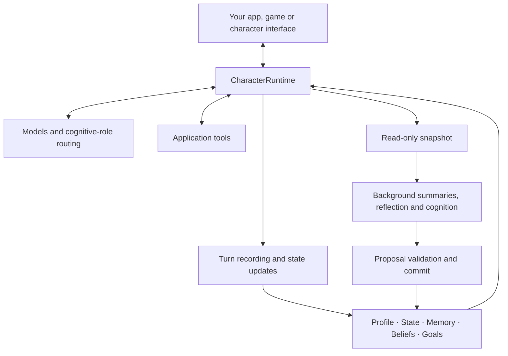

<p align="center">
  
</p>

<h1 align="center">AI Character Engine</h1>

<p align="center"><strong>A Python SDK for AI characters with memory, tools and ongoing conversations.</strong></p>

<p align="center">
  <a href="pyproject.toml"></a>
  <a href="LICENSE"></a>
  <a href="docs/getting-started.md"></a>
  <a href="https://github.com/weryk153/ai-character-engine/actions/workflows/ci.yml"></a>
</p>

<blockquote>
  <p align="center"><strong>Build companions, game NPCs and virtual assistants with a shared character runtime.</strong></p>
</blockquote>

<p align="center">
  <strong><a href="README.md">English</a> &nbsp;|&nbsp; <a href="README.zh-TW.md">繁體中文</a> &nbsp;|&nbsp; <a href="README.zh-CN.md">简体中文</a> &nbsp;|&nbsp; <a href="README.ja.md">日本語</a> &nbsp;|&nbsp; <a href="README.ko.md">한국어</a><br />
  <a href="README.es.md">Español</a> &nbsp;|&nbsp; <a href="README.fr.md">Français</a> &nbsp;|&nbsp; <a href="README.de.md">Deutsch</a> &nbsp;|&nbsp; <a href="README.pt-BR.md">Português (Brasil)</a></strong>
</p>

<p align="center">
  <strong><a href="docs/README.md">Documentation</a> &nbsp;|&nbsp; <a href="docs/getting-started.md">Installation</a> &nbsp;|&nbsp; <a href="examples/README.md">Examples</a> &nbsp;|&nbsp; <a href="docs/architecture.md">Architecture</a> &nbsp;|&nbsp; <a href="skills/ai-character-engine/SKILL.md">Agent Skill</a></strong>
</p>

---

## About

AI Character Engine helps you build AI companions, game NPCs and virtual assistants. Give a character a personality, let it remember interactions and keep track of unfinished work, then connect tools so it can act inside your application.

The engine manages the character’s data: conversations and long-term memories, emotion and relationship state, reflections, beliefs and ongoing goals. The model generates responses. Character records live outside the model, where you can inspect, revise and persist them, and keep using them when you change models.

Start with text chat or connect the engine to an existing desktop character, voice interface or game. The core works independently of any particular model or renderer; the VRM adapter is an optional package. Supports Linux, macOS and Windows with Python 3.11–3.13.

## ✨ Features

### 🧠 Memory and character state

- **Long-term memory:** Store useful moments from interactions and retrieve memories relevant to the current conversation. Includes correction, consolidation and forgetting.
- **Reflection and beliefs:** Build interpretations from past events and keep their supporting evidence. Insufficient or conflicting evidence has its own handling; repeating a model output does not turn it into a fact.
- **Emotion and relationships:** Track emotion, energy, trust, favorability and relationship stage. Your policies decide how interactions update them.
- **Saved sessions:** Save and restore conversation and relationship data so users can pick up where they left off.

### 🎯 Goals and actions

- **Ongoing goals:** Track what the character is working on, its motivation, and active, blocked, paused or completed status. Goals can remain after the topic changes.
- **Tool calls:** Register data lookups, game-state queries or application actions as tools the model can use during a turn. Your app owns the handlers and permissions.
- **Proactive interaction:** The autonomy host provides triggers and scheduling for interactions under your configured conditions. You supply the allowed actions and timing policies.

### ⚡ Background cognition and multiple models

- **Chat while processing experience:** Foreground turns handle conversation while background tasks summarize, reflect or perform other work, with concurrency limits, timeouts and cancellation.
- **Models by role:** Dialogue, summary, reflection and vision can share one model or use different endpoints with configured fallback.
- **Specialist collaboration:** An optional planner, specialists and verifier flow delegates a bounded task to different roles and collects their results.

### 🌍 Multiple characters and world interaction

- **Individual memories and perspectives:** Characters keep separate state and cognitive records, communicating through explicit messages.
- **Observations by character:** Perception rules determine who receives a world event. An NPC that sees a door open can receive that observation without making every other NPC aware of it.
- **Connect your world:** Interfaces cover world state, events and observations. Movement, physics and rendering stay in your application.

### 🎙️ Voice, vision and avatars

- **Live input:** Feed text and normalized visual or audio observations into the live runtime.
- **Voice conversations:** Interfaces and integration flows cover recognition, streaming synthesis, playback and interruption. Configure providers and devices before use.
- **Expression and lip-sync:** Produce expression, behavior and lip-sync cues for your host to map to its character model. The VRM adapter provides an optional connection.

Also included: event traces, persistence replay, cognitive evaluation, HTTP/SSE/WebSocket service interfaces and offline SFT/LoRA training tools. These modules are optional. Start with a text character and add the pieces you need.

## 🏗️ Architecture

`CharacterRuntime` is the entry point for one character. It assembles context, calls models and tools, and records the turn’s result. Profile, current state, memory, beliefs and goals are stored separately and included within their context budgets.



Background workers operate on snapshots. Their proposals are checked for provenance and revision before being committed, so an old task cannot simply overwrite newer character state. Models, speech services and renderers connect through interfaces; the runtime and commit flow coordinate writes to character data.

The [architecture guide](docs/architecture.md) covers foreground/background flows, character isolation, world perception and extension interfaces.

## 🚀 Quick start

You need **Python 3.11–3.13**.

```sh
git clone https://github.com/weryk153/ai-character-engine.git
cd ai-character-engine
python -m venv .venv
```

Activate the environment with `source .venv/bin/activate` on macOS/Linux or `.venv\Scripts\Activate.ps1` in Windows PowerShell, then install:

```sh
python -m pip install .
```

Start a local OpenAI-compatible model server, such as LM Studio. Replace `your-loaded-model` below with the loaded model’s identifier and adjust the URL to your server. Both calls use the same character, so the second receives the earlier exchange.

```python
import asyncio
from ai_character_engine import CharacterProfile, CharacterRuntime
from ai_character_engine.llm.local import OpenAICompatibleChatClient

async def main():
    llm = OpenAICompatibleChatClient(
        base_url="http://127.0.0.1:1234/v1",
        model="your-loaded-model",
    )
    character = CharacterRuntime(
        character=CharacterProfile(
            id="mei", name="Mei",
            description="A friendly companion who gives concise answers.",
        ),
        llm=llm,
    )
    try:
        print((await character.run_turn("Call me Alex.")).text)
        print((await character.run_turn("What name did I ask you to use?")).text)
    finally:
        await llm.client.close()

asyncio.run(main())
```

This example uses conversation history. For continuity across restarts, add [session save/restore](examples/session_runtime.py). Long-term memory, reflection and goals require their own configuration. See the [installation guide](docs/getting-started.md) for the full setup.

A host that talks to one character — a chat window, a voice application, a desktop avatar — can skip that configuration: [`CharacterCompanion`](docs/companion.md) is the engine assembled with memory, mood, goals, reflection and interruption already wired, behind a single `reply()`. Its context is written into the conversation as it grows, so a local model’s prompt cache stays usable from turn to turn. See [`examples/companion_chat.py`](examples/companion_chat.py).

## 🔌 Models and integrations

- **LLMs:** OpenAI Responses and OpenAI-compatible Chat Completions, including compatible LM Studio, Ollama and vLLM endpoints. You can also implement your own client. See [provider examples](examples/README.md).
- **Voice and avatars:** Install audio extras or the [VRM adapter](packages/renderer-vrm/README.md) as needed. Installing a package does not download models or start services.
- **Local or remote:** The core does not require a cloud service or API key. Local models can use local endpoints; your chosen providers and tools determine network use.

## 📂 Examples and docs

- [Character companion](examples/companion_chat.py): a terminal chat with one character that remembers what you tell it and changes over time, on a local OpenAI-compatible endpoint.
- [Interactive chat](examples/basic_chat.py) / [tool calls](examples/tool_chat.py): configure the model and credentials in `.env` before running.
- [Sessions](examples/session_runtime.py): save and restore using temporary storage and an offline client.
- [HTTP/SSE/WebSocket](examples/character_service.py): a service example for web or mobile clients. Uses an offline client by default; configure inference and authentication for deployment.
- [Autonomy](examples/autonomy_host.py): integrate character triggers and lifecycle.
- [Memory revision](tests/scenarios/memory_revision.py), [reflection and beliefs](tests/scenarios/reflection_long_term_cognition.py), [goals](tests/scenarios/goal_motivation_runtime.py), [world perception](tests/scenarios/world_environment.py): executable regression scenarios showing cognitive configuration and expected results.

[API reference](docs/api-reference.md) · [Configuration](docs/configuration.md) · [Deployment and operations](docs/operations.md) · [Extensions](docs/extensions.md)

## Development and license

Current version: **1.3.0**. CI covers Linux/macOS/Windows × Python 3.11/3.12/3.13, plus API compatibility, persistence replay, failure injection, same-environment performance and package installation. See [CI](https://github.com/weryk153/ai-character-engine/actions/workflows/ci.yml), [validation](VALIDATION.md) and [compatibility](docs/compatibility.md).

Issues and fixes are welcome; see [CONTRIBUTING](CONTRIBUTING.md). Licensed under [Apache-2.0](LICENSE). Third-party models, voices and assets retain their own licenses.
