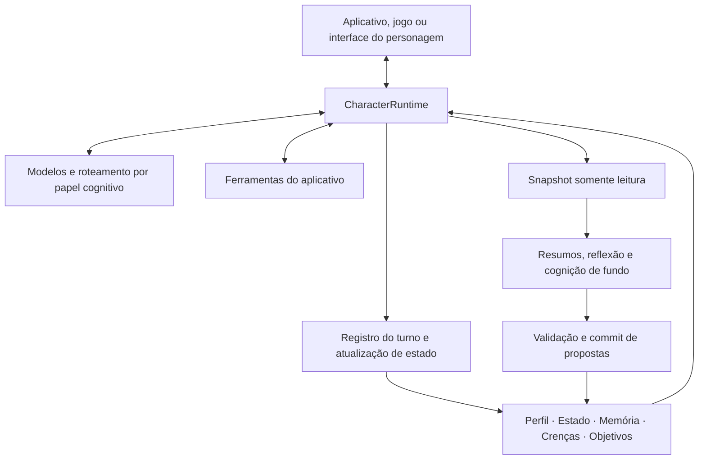

<p align="center">
  
</p>

<h1 align="center">AI Character Engine</h1>

<p align="center"><strong>Um SDK Python para personagens de IA com memória, ferramentas e conversas contínuas.</strong></p>

<p align="center">
  <a href="pyproject.toml"></a>
  <a href="LICENSE"></a>
  <a href="docs/getting-started.md"></a>
  <a href="https://github.com/weryk153/ai-character-engine/actions/workflows/ci.yml"></a>
</p>

<blockquote>
  <p align="center"><strong>Crie companheiros de IA, NPCs e assistentes virtuais com um mesmo runtime de personagens.</strong></p>
</blockquote>

<p align="center">
  <strong><a href="README.md">English</a> &nbsp;|&nbsp; <a href="README.zh-TW.md">繁體中文</a> &nbsp;|&nbsp; <a href="README.zh-CN.md">简体中文</a> &nbsp;|&nbsp; <a href="README.ja.md">日本語</a> &nbsp;|&nbsp; <a href="README.ko.md">한국어</a><br />
  <a href="README.es.md">Español</a> &nbsp;|&nbsp; <a href="README.fr.md">Français</a> &nbsp;|&nbsp; <a href="README.de.md">Deutsch</a> &nbsp;|&nbsp; <a href="README.pt-BR.md">Português (Brasil)</a></strong>
</p>

<p align="center">
  <strong><a href="docs/README.md">Documentação</a> &nbsp;|&nbsp; <a href="docs/getting-started.md">Instalação</a> &nbsp;|&nbsp; <a href="examples/README.md">Exemplos</a> &nbsp;|&nbsp; <a href="docs/architecture.md">Arquitetura</a> &nbsp;|&nbsp; <a href="skills/ai-character-engine/SKILL.md">Agent Skill</a></strong>
</p>

---

## Sobre o projeto

AI Character Engine permite criar companheiros de IA, NPCs e assistentes virtuais. Defina a personalidade, permita que lembrem interações e acompanhem tarefas pendentes, e conecte ferramentas para que eles ajam no seu aplicativo.

O motor gerencia conversas, memória de longo prazo, emoções, relações, reflexões, crenças e objetivos. O modelo gera respostas. Os dados do personagem ficam fora do modelo: você pode inspecionar, corrigir, salvar e continuar usando esses dados ao trocar de modelo.

Comece com texto ou integre o motor a um personagem de desktop, uma interface de voz ou um jogo. O núcleo não depende de um modelo ou renderer específico. O adaptador VRM é opcional. Suporta Linux, macOS e Windows com Python 3.11–3.13.

## ✨ Funcionalidades

### 🧠 Memória e estado do personagem

- **Memória de longo prazo:** Guarda momentos úteis e recupera memórias relevantes para o assunto atual. Inclui correção, consolidação e esquecimento.
- **Reflexão e crenças:** Organiza interpretações de eventos passados e preserva suas evidências. Evidências insuficientes ou conflitantes têm tratamento próprio; repetir uma resposta não cria um fato.
- **Emoções e relações:** Acompanha emoção, energia, confiança, afinidade e estágio da relação. Suas políticas definem como mudam.
- **Sessões salvas:** Salva e restaura conversas e relações para continuar na próxima visita.

### 🎯 Objetivos e ações

- **Objetivos contínuos:** Mantém tarefas, motivação e estados ativo, bloqueado, pausado ou concluído, mesmo após mudar de assunto.
- **Ferramentas:** Registre consultas de dados, leituras do estado do jogo ou ações do aplicativo. Implementação e permissões ficam no seu app.
- **Interação proativa:** O host de autonomia fornece gatilhos e agendamento. Configure as ações permitidas e quando executá-las.

### ⚡ Cognição em segundo plano e vários modelos

- **Conversar enquanto processa experiências:** Turnos em primeiro plano e resumos ou reflexões em segundo plano, com limites de concorrência, tempos limite e cancelamento.
- **Modelos por função:** Diálogo, resumo, reflexão e visão podem compartilhar um modelo ou usar endpoints distintos com fallback configurado.
- **Especialistas:** Um fluxo opcional de planejador, especialistas e verificador distribui uma tarefa limitada e reúne resultados.

### 🌍 Vários personagens e interação com o mundo

- **Memórias e perspectivas próprias:** Cada personagem mantém estado e dados cognitivos separados, comunicando-se por mensagens explícitas.
- **Observações por personagem:** Regras de percepção definem quem recebe um evento. Um NPC pode ver uma porta abrir sem que todos os outros saibam.
- **Conecte seu mundo:** Interfaces para estado do mundo, eventos e observações. Movimento, física e renderização ficam no host.

### 🎙️ Voz, visão e avatares

- **Entrada ao vivo:** Envie texto e observações visuais ou de áudio normalizadas ao live runtime.
- **Conversas por voz:** Interfaces e fluxos para reconhecimento, síntese em streaming, reprodução e interrupções. Provedores e dispositivos precisam estar configurados.
- **Expressões e sincronização labial:** Produz sinais de expressão, comportamento e movimento labial para o modelo do host. O adaptador VRM é uma conexão opcional.

Também inclui rastros de eventos, replay de persistência, avaliação cognitiva, serviços HTTP/SSE/WebSocket e ferramentas de treinamento offline SFT/LoRA. Os módulos são opcionais: comece com texto e adicione o que precisar.

## 🏗️ Arquitetura

`CharacterRuntime` é a entrada de um personagem. Compõe o contexto, chama modelos e ferramentas e registra o resultado do turno. Perfil, estado, memória, crenças e objetivos são armazenados separadamente e incluídos em seus orçamentos de contexto.



Workers usam snapshots. Procedência e revisão são verificadas antes do commit para evitar que uma tarefa antiga sobrescreva um estado novo. Modelos, serviços de voz e renderers se conectam por interfaces; o runtime e o fluxo de commit coordenam as escritas.

O [guia de arquitetura](docs/architecture.md) detalha os fluxos, o isolamento de personagens, a percepção do mundo e as extensões.

## 🚀 Início rápido

Você precisa de **Python 3.11–3.13**.

```sh
git clone https://github.com/weryk153/ai-character-engine.git
cd ai-character-engine
python -m venv .venv
```

Ative o ambiente com `source .venv/bin/activate` no macOS/Linux ou `.venv\Scripts\Activate.ps1` no Windows PowerShell. Depois instale:

```sh
python -m pip install .
```

Inicie um servidor local compatível com OpenAI, como LM Studio. Troque `your-loaded-model` pelo identificador do modelo carregado e ajuste a URL. As chamadas usam o mesmo personagem; a segunda recebe a conversa anterior.

```python
import asyncio
from ai_character_engine import CharacterProfile, CharacterRuntime
from ai_character_engine.llm.local import OpenAICompatibleChatClient

async def main():
    llm = OpenAICompatibleChatClient(
        base_url="http://127.0.0.1:1234/v1",
        model="your-loaded-model",
    )
    character = CharacterRuntime(
        character=CharacterProfile(
            id="mei", name="Mei",
            description="A friendly companion who gives concise answers.",
        ),
        llm=llm,
    )
    try:
        print((await character.run_turn("Call me Alex.")).text)
        print((await character.run_turn("What name did I ask you to use?")).text)
    finally:
        await llm.client.close()

asyncio.run(main())
```

O exemplo usa histórico de conversa. Para continuar após reiniciar, adicione [sessões salvas](examples/session_runtime.py). Memória de longo prazo, reflexão e objetivos são configurados separadamente. Consulte o [guia de instalação](docs/getting-started.md).

Um host que conversa com um único personagem — uma janela de chat, um aplicativo de voz, um avatar de desktop — pode pular essa configuração: [`CharacterCompanion`](docs/companion.md) é o motor com memória, humor, objetivos, reflexão e interrupção já conectados, atrás de um único `reply()`. Seu contexto é escrito dentro da conversa conforme ela cresce, então o cache de prompt de um modelo local continua útil de turno em turno. Veja [`examples/companion_chat.py`](examples/companion_chat.py).

## 🔌 Modelos e integrações

- **LLM:** OpenAI Responses e Chat Completions compatível com OpenAI, incluindo endpoints compatíveis de LM Studio, Ollama e vLLM. Você também pode implementar seu client. [Exemplos de provedores](examples/README.md).
- **Voz e avatares:** Extras de áudio e [adaptador VRM](packages/renderer-vrm/README.md), conforme necessário. Instalar pacotes não baixa modelos nem inicia serviços.
- **Local ou remoto:** O núcleo não exige nuvem nem chave de API. Modelos locais podem usar endpoints locais; os provedores e ferramentas escolhidos determinam o uso da rede.

## 📂 Exemplos e documentação

- [Personagem companheiro](examples/companion_chat.py): um chat no terminal com um personagem que lembra o que você conta e muda com o tempo, em um endpoint local compatível com OpenAI.
- [Chat interativo](examples/basic_chat.py) / [ferramentas](examples/tool_chat.py): configure modelo e credenciais no `.env`.
- [Sessões](examples/session_runtime.py): salvar e restaurar com armazenamento temporário e client offline.
- [HTTP/SSE/WebSocket](examples/character_service.py): serviço para web ou celular com client offline por padrão. Configure inferência e autenticação para implantação.
- [Autonomy](examples/autonomy_host.py): gatilhos e ciclo de vida.
- [Revisão de memória](tests/scenarios/memory_revision.py), [reflexão e crenças](tests/scenarios/reflection_long_term_cognition.py), [objetivos](tests/scenarios/goal_motivation_runtime.py), [percepção](tests/scenarios/world_environment.py): cenários de regressão executáveis com configuração e resultados esperados.

[Referência da API](docs/api-reference.md) · [Configuração](docs/configuration.md) · [Implantação e operação](docs/operations.md) · [Extensões](docs/extensions.md)

## Desenvolvimento e licença

Versão atual: **1.1.0**. CI cobre Linux/macOS/Windows × Python 3.11/3.12/3.13, compatibilidade da API, replay de persistência, injeção de falhas, desempenho no mesmo ambiente e instalação de pacotes. [CI](https://github.com/weryk153/ai-character-engine/actions/workflows/ci.yml) · [Validação](VALIDATION.md) · [Compatibilidade](docs/compatibility.md).

Relatos de problemas e correções são bem-vindos; consulte [CONTRIBUTING](CONTRIBUTING.md). Licença [Apache-2.0](LICENSE). Modelos, vozes e recursos de terceiros mantêm suas próprias licenças.
