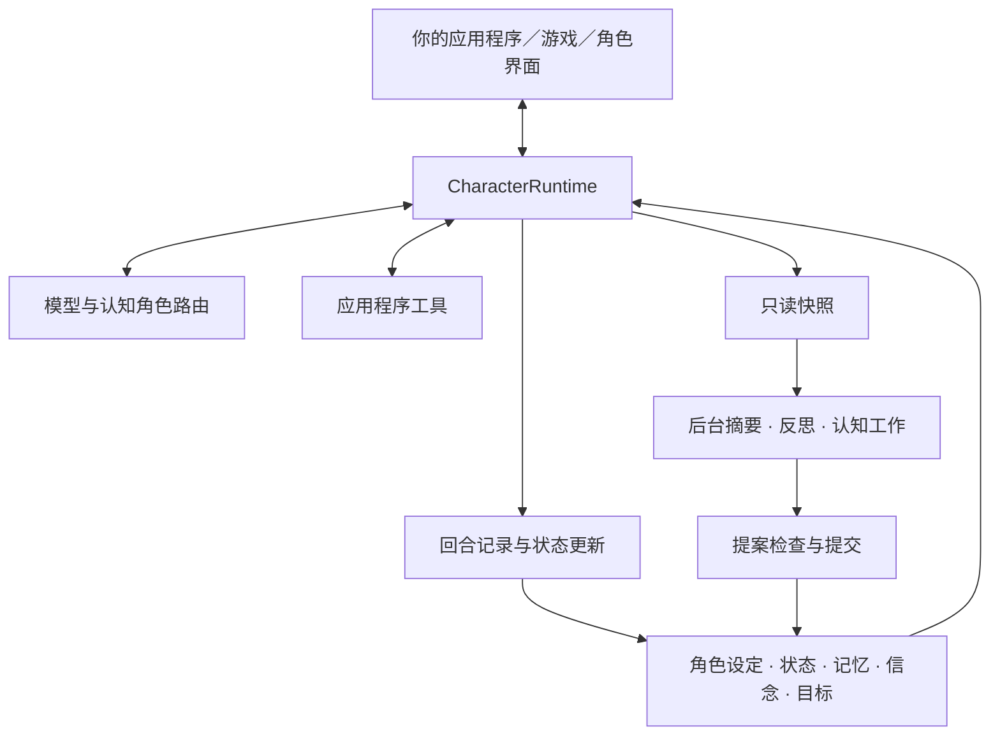

<p align="center">
  
</p>

<h1 align="center">AI Character Engine</h1>

<p align="center"><strong>用 Python 打造有记忆、会使用工具、能持续互动的 AI 角色。</strong></p>

<p align="center">
  <a href="pyproject.toml"></a>
  <a href="LICENSE"></a>
  <a href="docs/getting-started.md"></a>
  <a href="https://github.com/weryk153/ai-character-engine/actions/workflows/ci.yml"></a>
</p>

<blockquote>
  <p align="center"><strong>用同一套角色核心，开发 AI 陪伴角色、游戏 NPC 与虚拟助手。</strong></p>
</blockquote>

<p align="center">
  <strong><a href="README.md">English</a> &nbsp;|&nbsp; <a href="README.zh-TW.md">繁體中文</a> &nbsp;|&nbsp; <a href="README.zh-CN.md">简体中文</a> &nbsp;|&nbsp; <a href="README.ja.md">日本語</a> &nbsp;|&nbsp; <a href="README.ko.md">한국어</a><br />
  <a href="README.es.md">Español</a> &nbsp;|&nbsp; <a href="README.fr.md">Français</a> &nbsp;|&nbsp; <a href="README.de.md">Deutsch</a> &nbsp;|&nbsp; <a href="README.pt-BR.md">Português (Brasil)</a></strong>
</p>

<p align="center">
  <strong><a href="docs/README.md">文档</a> &nbsp;|&nbsp; <a href="docs/getting-started.md">安装</a> &nbsp;|&nbsp; <a href="examples/README.md">示例</a> &nbsp;|&nbsp; <a href="docs/architecture.md">架构</a> &nbsp;|&nbsp; <a href="skills/ai-character-engine/SKILL.md">Agent Skill</a></strong>
</p>

---

## 项目简介

AI Character Engine 是开发 AI 陪伴角色、游戏 NPC 和虚拟助手的 Python SDK。你可以设置角色的个性，让它记住交互、跟踪未完成的事，并通过工具操作你的应用程序。

角色的数据由引擎管理：对话与长期记忆、情绪与关系状态、对经历的反思、累积的信念，以及正在进行的目标。模型负责生成响应；这些数据保存在模型之外，可以检查、修改和持久化。换一个模型时，也能继续使用原有的角色数据。

你可以先做纯文本聊天，也可以接到现有桌面角色、语音界面或游戏里。核心不绑定特定模型或渲染器；VRM adapter 可按需安装。支持 Linux、macOS、Windows，Python 3.11–3.13。

## ✨ 功能亮点

### 🧠 记忆与角色状态

- **长期记忆**：保存交互中值得留下的内容，检索与当前话题相关的记忆。支持记忆更正、合并与遗忘。
- **反思与信念**：从过去的事件整理理解，保留支持它的证据。来源不足或互相矛盾的内容有各自的处理流程，不会因模型多说几次就变成事实。
- **情绪与关系**：提供情绪、精力、信任、好感与关系阶段等状态，由你的策略决定如何随互动更新。
- **Session 保存**：保存、还原对话与关系数据，让用户下次回来接着聊。

### 🎯 目标与行动

- **持续目标**：跟踪角色正在做什么，保留动机与进行中、受阻、暂停、完成等状态。换了话题，目标仍可以留下。
- **工具调用**：把查数据、读取游戏状态或执行应用程序操作注册成工具，交由模型在回合中使用。工具实现与权限由应用程序控制。
- **主动交互**：Autonomy 宿主提供触发与调度机制，可依你设置的条件发起交互；需要配置允许的行动与执行时机。

### ⚡ 后台认知与多模型

- **边对话、边整理**：前台处理用户的回合，后台执行摘要、反思等工作，搭配并发上限、超时与取消。
- **模型分工**：对话、摘要、反思、视觉等认知角色可以共用一个模型，也可以分配到不同端点，配置 fallback。
- **专家协作**：可选的规划者、专家与验证者流程，让指定任务交给不同角色分析，再收集结果。

### 🌍 多角色与世界互动

- **各自的记忆与想法**：多个角色保有自己的状态与认知数据，通过明确消息交流。
- **按角色接收观察**：世界事件依感知规则送给角色。例如只有看见门打开的 NPC 才收到这项观察；世界更新不会自动让所有角色都知道。
- **接入你的世界**：世界状态、事件与观察有对应接口；游戏的移动、物理与渲染留在宿主。

### 🎙️ 语音、视觉与虚拟角色

- **实时输入**：接收文字及标准化的视觉、音频等观察，交由 live runtime 协调。
- **语音对话**：提供语音识别、流式合成、播放与打断的接口和集成流程；使用前需配置 provider 与设备。
- **表情与唇形**：输出表情、行为与唇形提示，让宿主映射到自己的角色模型。VRM adapter 可另外接入。

另外提供事件跟踪、持久化回放、认知评估、HTTP／SSE／WebSocket 服务接口，以及离线 SFT／LoRA 训练工具。这些都是可选模块；可以先跑一个文本角色，再逐步接上需要的部分。

## 🏗️ 架构

`CharacterRuntime` 是单一角色的入口，负责组合上下文、调用模型与工具，再记录这一轮的结果。角色设定与当前状态、记忆、信念、目标分开存储，依各自的预算放入上下文。



后台 worker 使用快照工作，结果提交前会检查来源与版本，避免旧任务覆盖新的角色状态。模型、语音服务、渲染器都通过接口接入，角色数据的写入仍由 runtime 与提交流程协调。

[完整架构说明](docs/architecture.md)包含前台／后台数据流、多角色隔离、世界感知与扩展接口。

## 🚀 快速上手

需要 **Python 3.11–3.13**。

```sh
git clone https://github.com/weryk153/ai-character-engine.git
cd ai-character-engine
python -m venv .venv
```

激活虚拟环境：macOS／Linux 使用 `source .venv/bin/activate`；Windows PowerShell 使用 `.venv\Scripts\Activate.ps1`。接着安装：

```sh
python -m pip install .
```

先启动一个本地 OpenAI 兼容模型服务，例如 LM Studio。把下方的 `your-loaded-model` 换成已加载的模型名称，地址则依服务配置调整。两次调用共用同一个角色，第二轮会收到前面的对话。

```python
import asyncio
from ai_character_engine import CharacterProfile, CharacterRuntime
from ai_character_engine.llm.local import OpenAICompatibleChatClient

async def main():
    llm = OpenAICompatibleChatClient(
        base_url="http://127.0.0.1:1234/v1",
        model="your-loaded-model",
    )
    character = CharacterRuntime(
        character=CharacterProfile(
            id="mei", name="Mei",
            description="A friendly companion who gives concise answers.",
        ),
        llm=llm,
    )
    try:
        print((await character.run_turn("Call me Alex.")).text)
        print((await character.run_turn("What name did I ask you to use?")).text)
    finally:
        await llm.client.close()

asyncio.run(main())
```

这个示例使用对话历史。要在程序重启后接续，请接上 [Session 保存与还原](examples/session_runtime.py)；长期记忆、反思与目标需另行配置。完整步骤见[安装指南](docs/getting-started.md)。

只跟一个角色对话的宿主——聊天窗口、语音应用、桌面角色——可以省掉那些配置：[`CharacterCompanion`](docs/companion.md) 是已经接好记忆、心情、目标、反思与打断的引擎，对外只提供一个 `reply()`。它的上下文会随着对话进行逐步写进对话内容，因此本地模型的提示词缓存每一轮都能继续使用。见 [`examples/companion_chat.py`](examples/companion_chat.py)。

## 🔌 模型与整合

- **LLM**：OpenAI Responses 与 OpenAI 兼容 Chat Completions；可接 LM Studio、Ollama、vLLM 等兼容端点，也可实现自己的 client。见 [provider 示例](examples/README.md)。
- **语音与虚拟角色**：按需安装音频 extra 或 [VRM adapter](packages/renderer-vrm/README.md)。包不会自动下载模型或启动服务。
- **本地或远程**：核心不要求云端服务或 API key。本地模型可以走本地端点；外部服务与工具是否联网，由你的配置决定。

## 📂 示例与文档

- [角色伙伴](examples/companion_chat.py)：在终端里跟一个角色聊天；角色会记得你说过的事，也会随时间改变。接本地的 OpenAI 兼容端点。
- [交互式聊天](examples/basic_chat.py)／[工具调用](examples/tool_chat.py)：配置 `.env` 中的模型与凭证后运行。
- [Session](examples/session_runtime.py)：使用临时存储与离线 client 示范保存、还原。
- [HTTP／SSE／WebSocket](examples/character_service.py)：接入网页或移动端的服务示例，默认使用离线 client；正式使用需配置模型与认证。
- [Autonomy](examples/autonomy_host.py)：角色触发与生命周期整合。
- [记忆修正](tests/scenarios/memory_revision.py)、[反思与信念](tests/scenarios/reflection_long_term_cognition.py)、[目标](tests/scenarios/goal_motivation_runtime.py)、[世界感知](tests/scenarios/world_environment.py)：可执行的回归场景，展示认知机制的配置与预期结果。

[API 参考](docs/api-reference.md) · [配置](docs/configuration.md) · [部署与运维](docs/operations.md) · [扩展开发](docs/extensions.md)

## 开发与授权

当前版本 **1.0.0**。CI 涵盖 Linux／macOS／Windows × Python 3.11／3.12／3.13，并检查 API 兼容性、持久化回放、故障注入、同环境性能及包安装。详见 [CI](https://github.com/weryk153/ai-character-engine/actions/workflows/ci.yml)、[验证](VALIDATION.md)与[兼容性](docs/compatibility.md)。

欢迎提交问题与修正；参与方式见 [CONTRIBUTING](CONTRIBUTING.md)。本项目采用 [Apache-2.0](LICENSE)。第三方模型、声音与素材依各自授权使用。
