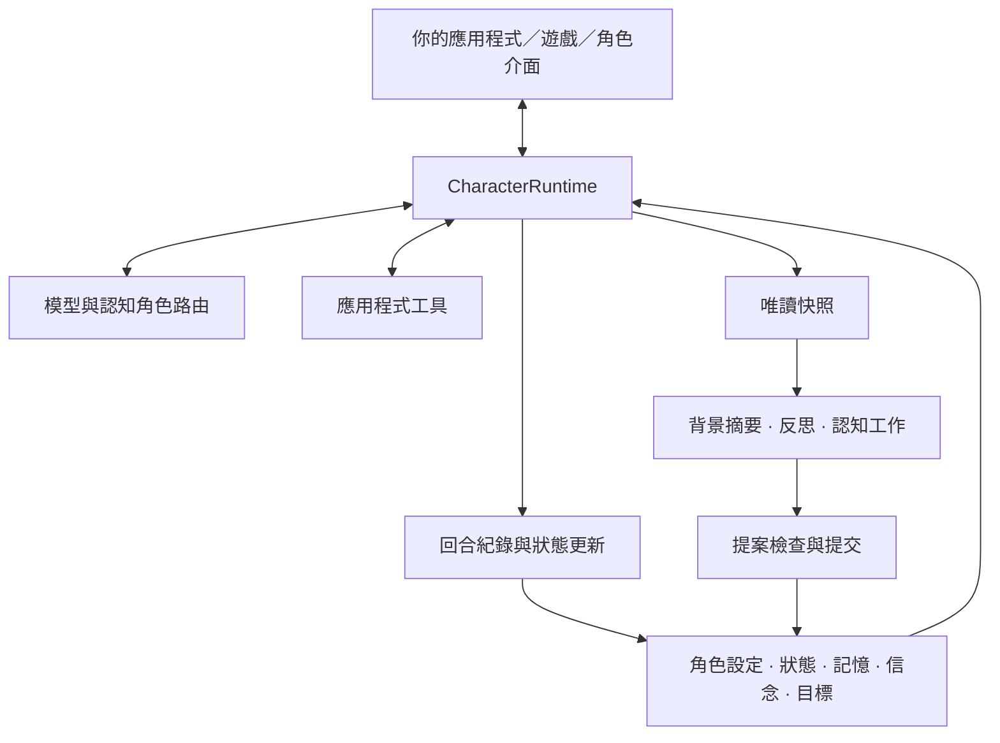

<p align="center">
  
</p>

<h1 align="center">AI Character Engine</h1>

<p align="center"><strong>用 Python 打造有記憶、會使用工具、能持續互動的 AI 角色。</strong></p>

<p align="center">
  <a href="pyproject.toml"></a>
  <a href="LICENSE"></a>
  <a href="docs/getting-started.md"></a>
  <a href="https://github.com/weryk153/ai-character-engine/actions/workflows/ci.yml"></a>
</p>

<blockquote>
  <p align="center"><strong>用同一套角色核心，開發 AI 陪伴角色、遊戲 NPC 與虛擬助理。</strong></p>
</blockquote>

<p align="center">
  <strong><a href="README.md">English</a> &nbsp;|&nbsp; <a href="README.zh-TW.md">繁體中文</a> &nbsp;|&nbsp; <a href="README.zh-CN.md">简体中文</a> &nbsp;|&nbsp; <a href="README.ja.md">日本語</a> &nbsp;|&nbsp; <a href="README.ko.md">한국어</a><br />
  <a href="README.es.md">Español</a> &nbsp;|&nbsp; <a href="README.fr.md">Français</a> &nbsp;|&nbsp; <a href="README.de.md">Deutsch</a> &nbsp;|&nbsp; <a href="README.pt-BR.md">Português (Brasil)</a></strong>
</p>

<p align="center">
  <strong><a href="docs/README.md">文件</a> &nbsp;|&nbsp; <a href="docs/getting-started.md">安裝</a> &nbsp;|&nbsp; <a href="examples/README.md">範例</a> &nbsp;|&nbsp; <a href="docs/architecture.md">架構</a> &nbsp;|&nbsp; <a href="skills/ai-character-engine/SKILL.md">Agent Skill</a></strong>
</p>

---

## 專案簡介

AI Character Engine 是開發 AI 陪伴角色、遊戲 NPC 和虛擬助理的 Python SDK。你可以設定角色的個性，讓它記住互動、追蹤未完成的事，並透過工具操作你的應用程式。

角色的資料由引擎管理：對話與長期記憶、情緒與關係狀態、對經歷的反思、累積的信念，以及正在進行的目標。模型負責生成回應；這些資料保存在模型之外，可以檢查、修改和持久化。換一個模型時，也能繼續使用原有的角色資料。

你可以先做純文字聊天，也可以接到既有桌面角色、語音介面或遊戲裡。核心不綁定特定模型或渲染器；VRM adapter 可依需要安裝。支援 Linux、macOS、Windows，Python 3.11–3.13。

## ✨ 功能亮點

### 🧠 記憶與角色狀態

- **長期記憶**：保存互動中值得留下的內容，檢索與當前話題相關的記憶。支援記憶更正、合併與遺忘。
- **反思與信念**：從過去的事件整理理解，保留支持它的證據。來源不足或互相矛盾的內容有各自的處理流程，不會因模型多說幾次就變成事實。
- **情緒與關係**：提供情緒、精力、信任、好感與關係階段等狀態，由你的政策決定如何隨互動更新。
- **Session 保存**：保存、還原對話與關係資料，讓使用者下次回來接著聊。

### 🎯 目標與行動

- **持續目標**：追蹤角色正在做什麼，保留動機與進行中、受阻、暫停、完成等狀態。換了話題，目標仍可以留下。
- **工具呼叫**：把查資料、讀取遊戲狀態或執行應用程式操作註冊成工具，交由模型在回合中使用。工具實作與權限由應用程式控制。
- **主動互動**：Autonomy 宿主提供觸發與排程機制，可依你設定的條件發起互動；需要配置允許的行動與執行時機。

### ⚡ 背景認知與多模型

- **邊對話、邊整理**：前景處理使用者的回合，背景執行摘要、反思等工作，搭配並行上限、逾時與取消。
- **模型分工**：對話、摘要、反思、視覺等認知角色可以共用一個模型，也可以分配到不同端點，設定 fallback。
- **專家協作**：可選的規劃者、專家與驗證者流程，讓指定任務交給不同角色分析，再收集結果。

### 🌍 多角色與世界互動

- **各自的記憶與想法**：多個角色保有自己的狀態與認知資料，透過明確訊息交流。
- **按角色接收觀察**：世界事件依感知規則送給角色。例如只有看見門打開的 NPC 才收到這項觀察；世界更新不會自動讓所有角色都知道。
- **接入你的世界**：世界狀態、事件與觀察有對應介面；遊戲的移動、物理與渲染留在宿主。

### 🎙️ 語音、視覺與虛擬角色

- **即時輸入**：接收文字及正規化的視覺、音訊等觀察，交由 live runtime 協調。
- **語音對話**：提供語音辨識、串流合成、播放與打斷的介面和整合流程；使用前需配置 provider 與裝置。
- **表情與唇形**：輸出表情、行為與唇形提示，讓宿主映射到自己的角色模型。VRM adapter 可另外接入。

另外提供事件追蹤、持久化回放、認知評估、HTTP／SSE／WebSocket 服務介面，以及離線 SFT／LoRA 訓練工具。這些都是可選模組；可以先跑一個文字角色，再逐步接上需要的部分。

## 🏗️ 架構

`CharacterRuntime` 是單一角色的入口，負責組合上下文、呼叫模型與工具，再記錄這一輪的結果。角色設定與當前狀態、記憶、信念、目標分開儲存，依各自的預算放入上下文。



背景 worker 使用快照工作，結果提交前會檢查來源與版本，避免舊任務覆蓋新的角色狀態。模型、語音服務、渲染器都透過介面接入，角色資料的寫入仍由 runtime 與提交流程協調。

[完整架構說明](docs/architecture.md)包含前景／背景資料流、多角色隔離、世界感知與擴充介面。

## 🚀 快速上手

需要 **Python 3.11–3.13**。

```sh
git clone https://github.com/weryk153/ai-character-engine.git
cd ai-character-engine
python -m venv .venv
```

啟用虛擬環境：macOS／Linux 使用 `source .venv/bin/activate`；Windows PowerShell 使用 `.venv\Scripts\Activate.ps1`。接著安裝：

```sh
python -m pip install .
```

先啟動一個本機 OpenAI 相容模型服務，例如 LM Studio。把下方的 `your-loaded-model` 換成已載入的模型名稱，網址則依服務設定調整。兩次呼叫共用同一個角色，第二輪會收到前面的對話。

```python
import asyncio
from ai_character_engine import CharacterProfile, CharacterRuntime
from ai_character_engine.llm.local import OpenAICompatibleChatClient

async def main():
    llm = OpenAICompatibleChatClient(
        base_url="http://127.0.0.1:1234/v1",
        model="your-loaded-model",
    )
    character = CharacterRuntime(
        character=CharacterProfile(
            id="mei", name="Mei",
            description="A friendly companion who gives concise answers.",
        ),
        llm=llm,
    )
    try:
        print((await character.run_turn("Call me Alex.")).text)
        print((await character.run_turn("What name did I ask you to use?")).text)
    finally:
        await llm.client.close()

asyncio.run(main())
```

這個範例使用對話歷史。要在程式重啟後接續，請接上 [Session 保存與還原](examples/session_runtime.py)；長期記憶、反思與目標需另行配置。完整步驟見[安裝指南](docs/getting-started.md)。

只跟一個角色對話的宿主——聊天視窗、語音應用、桌面角色——可以省掉那些配置：[`CharacterCompanion`](docs/companion.md) 是已經接好記憶、心情、目標、反思與打斷的引擎，對外只提供一個 `reply()`。它的上下文會隨著對話進行逐步寫進對話內容，因此本機模型的提示快取每一輪都能沿用。見 [`examples/companion_chat.py`](examples/companion_chat.py)。

## 🔌 模型與整合

- **LLM**：OpenAI Responses 與 OpenAI 相容 Chat Completions；可接 LM Studio、Ollama、vLLM 等相容端點，也可實作自己的 client。見 [provider 範例](examples/README.md)。
- **語音與虛擬角色**：依需要安裝音訊 extra 或 [VRM adapter](packages/renderer-vrm/README.md)。套件不會自動下載模型或啟動服務。
- **本機或遠端**：核心不要求雲端服務或 API key。本機模型可以走本機端點；外部服務與工具是否連網，由你的配置決定。

## 📂 範例與文件

- [角色夥伴](examples/companion_chat.py)：在終端機裡跟一個角色聊天；角色會記得你說過的事，也會隨時間改變。接本機的 OpenAI 相容端點。
- [互動聊天](examples/basic_chat.py)／[工具呼叫](examples/tool_chat.py)：配置 `.env` 中的模型與憑證後執行。
- [Session](examples/session_runtime.py)：使用暫存目錄與離線 client 示範保存、還原。
- [HTTP／SSE／WebSocket](examples/character_service.py)：接入網頁或行動端的服務範例，預設使用離線 client；正式使用需配置模型與身分驗證。
- [Autonomy](examples/autonomy_host.py)：角色觸發與生命週期整合。
- [記憶修正](tests/scenarios/memory_revision.py)、[反思與信念](tests/scenarios/reflection_long_term_cognition.py)、[目標](tests/scenarios/goal_motivation_runtime.py)、[世界感知](tests/scenarios/world_environment.py)：可執行的回歸情境，展示認知機制的配置與預期結果。

[API 參考](docs/api-reference.md) · [設定](docs/configuration.md) · [部署與維運](docs/operations.md) · [擴充開發](docs/extensions.md)

## 開發與授權

目前版本 **1.3.0**。CI 涵蓋 Linux／macOS／Windows × Python 3.11／3.12／3.13，並檢查 API 相容性、持久化回放、故障注入、同環境效能及套件安裝。詳見 [CI](https://github.com/weryk153/ai-character-engine/actions/workflows/ci.yml)、[驗證](VALIDATION.md)與[相容性](docs/compatibility.md)。

歡迎提交問題與修正；參與方式見 [CONTRIBUTING](CONTRIBUTING.md)。本專案採用 [Apache-2.0](LICENSE)。第三方模型、聲音與素材依各自授權使用。
