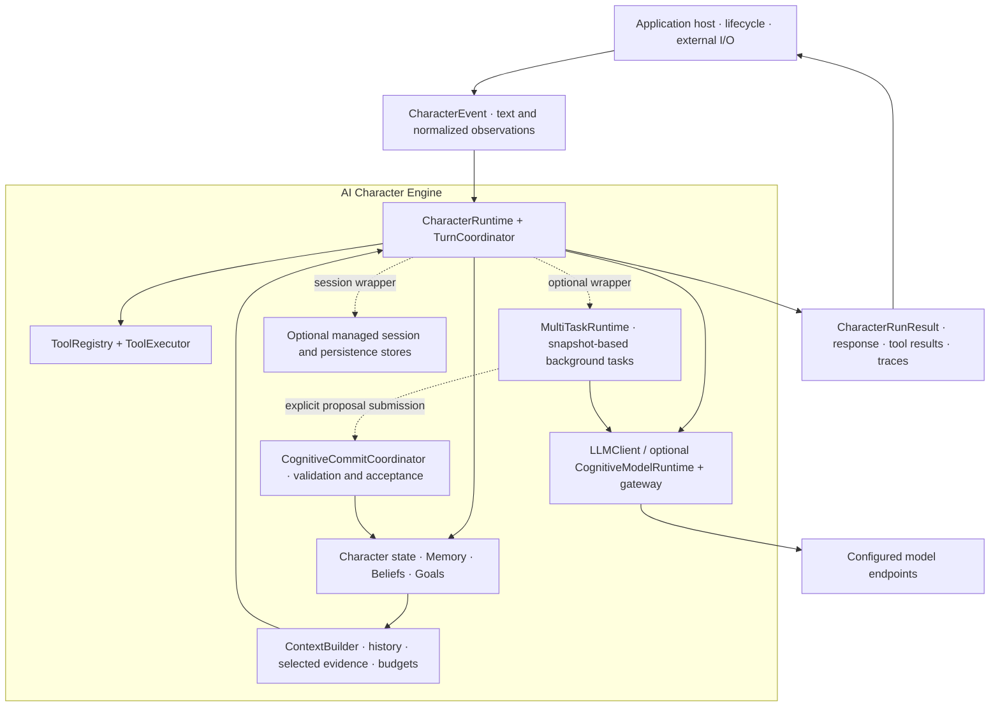
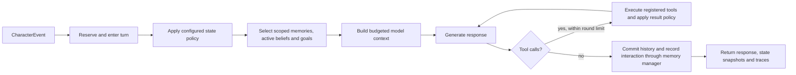
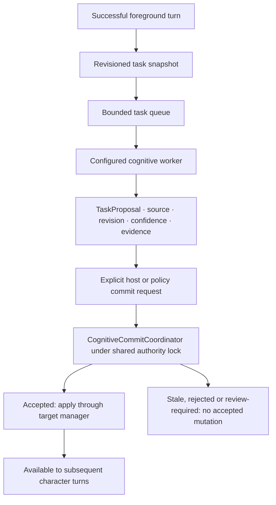

# Architecture and state ownership

AI Character Engine separates **foreground interaction**, **background cognition**
and **authoritative state changes**. A host assembles the components it needs:
`CharacterRuntime` can run on its own; persistence, cognitive workers, shared
worlds, network services and presentation adapters are explicit integrations.
Creating a character does not start those optional systems.

Solid arrows show data flow or an invocation; dashed arrows show optional host
composition. The core owns turn coordination and state acceptance. The host owns
application lifecycle, credentials, external tool implementations and deployment.
Model endpoints supply inference. Renderers consume output. Neither providers nor
presentation adapters become an authority over character state.

## Foreground: observe, decide, act, record

A foreground turn is the character's immediate response to an event. The runtime
serializes it through `TurnCoordinator` and keeps a trace of what it read, which
tools it executed and what it recorded.

The context combines the character profile, conversation history, current state,
selected evidence, active beliefs/goals and available tool definitions. Memory
revision requests are previewed before inference so the response can be checked
against the planned operation. Retrieval and context-budget decisions are exposed
in the result rather than hidden inside a prompt.

What changes between turns (state, goals, beliefs, retrieved memories) is never
written into the system prompt. It is written into the conversation as notes: a
note sits right in front of the message it was written for, says only what no
earlier note still in the conversation has said, and stays there. The prompt of
a turn is then the prompt of the previous turn plus what was added, which lets
an inference server reuse its work whatever the granularity of its prompt cache.
Notes are sent with the user role, because chat templates may move system
messages to the top, and the system prompt explains how to read them.
`CharacterRuntime.history` holds only what was said; the notes are kept next to
it in `CharacterRuntime.context_notes`. `is_turn_context(message)` tells a
custom model client which user-role message is a note rather than speech.

`ContextBuilder(context_placement="turn")` sends the whole context in one
message that is not kept; a server that continues only from checkpoints then
reads the conversation again on every turn once the context is longer than a
checkpoint interval. `context_placement="system"` appends the context to the
system prompt, where any change invalidates the cache for the whole
conversation. When the history limit is reached, old turns leave a quarter of
the conversation at a time, so that prompts keep their beginning in between.

Tool execution uses explicitly registered handlers and a bounded model/tool loop
(`max_tool_rounds`, default 5). A successful event records the final response and,
when a memory manager is configured, the interaction and its evidence lineage.
`run_turn(text)` returns an `LLMResponse`; `process_event(event)` returns the richer
`CharacterRunResult`, including tool results, state snapshots, memory outcomes
and context/retrieval traces.

On failure, the runtime restores its local history and character-state snapshot.
External tool effects and already-started store writes can require review; local
rollback is not an atomic transaction across external systems. Session persistence
is provided by the managed-session layer, with stores chosen by the host.

Implementation: [character runtime](../src/ai_character_engine/runtime/character_runtime.py),
[context construction](../src/ai_character_engine/context),
[tools](../src/ai_character_engine/tools), [sessions](../src/ai_character_engine/session).

## Background cognition and commit

`MultiTaskRuntime` adds a bounded priority queue, worker limits, timeouts,
cancellation and revisioned snapshots around a character. Foreground turns use
the authoritative turn path; background handlers receive snapshots and return
results or proposals.

`BackgroundCognitionRuntime` can schedule memory extraction, emotion analysis,
conversation summaries, reflection, goal/motivation and vision interpretation
after a successful foreground turn. Each worker has its own cadence, concurrency
limit and timeout. The foreground waits for queue admission, not background model
inference. Queue saturation does not retroactively fail an already completed turn.

Collecting a worker result does not commit it. The coordinator checks the target,
worker provenance, confidence, age, base revision and target-specific evidence
rules while sharing the foreground authority lock. Supported targets include
memory candidates, summaries, emotion updates, reflection and goals. A target also
needs its corresponding manager and policy; vision interpretation remains
review-only. Repeated proposals are tracked, and stale proposals follow explicit
rerun or manual-rebase policy.

`SpecialistCollaborationRuntime` provides another optional reasoning path: a
bounded **planner → parallel specialists → verifier** workflow. Its output is
advisory. Specialists cannot spawn peers, invoke host tools or mutate character
stores. This workflow does not automatically turn its report into a committed
memory, belief or goal.

Implementation: [task runtime](../src/ai_character_engine/tasks/runtime.py),
[background cognition](../src/ai_character_engine/cognition/background.py),
[commit coordinator](../src/ai_character_engine/commit/coordinator.py),
[specialist collaboration](../src/ai_character_engine/collaboration/runtime.py).

## Memory, reflection, beliefs, goals and world state

These surfaces retain different kinds of information. Keeping them separate makes
it possible to revise a belief without rewriting an observed event, or to reject
a proposed goal without losing the evidence that suggested it.

| Surface | Meaning | Owner and write boundary | Use in the character |
|---|---|---|---|
| Event ledger | Recorded observations and interactions | Canonical event recording | Traceable source evidence |
| Memory | Retained, scoped evidence with provenance | `MemoryManager`, revision and consolidation policies | Retrieval into turn context |
| Reflection | An interpretation of evidence | `LongTermCognitionManager` and reflection policy | Input to further cognitive evaluation |
| Belief | A revisable, evidence-backed hypothesis | Explicit consolidation and revision policy | Active beliefs in turn context |
| Goal | A grounded intention with lifecycle state | `GoalManager` and goal policy | Active goals in turn context |
| Character state | Current per-character state, including emotion | State policy and coordinated commits | Immediate response context |
| World state | Canonical shared environment and revisions | `WorldRuntime` | Perception-filtered observations |

A reflection is not automatically a fact. A proposed goal is not permission to
execute a tool. The host must configure the policies that connect interpretation,
consolidation and action. Memory, cognition and goal scopes are explicit; session
factories and multi-character coordination preserve the relevant isolation.

## Model routing and task scheduling

Task scheduling decides **when work runs**. Model routing decides **which
configured endpoint handles inference**. They are separate components.

| Layer | Responsibility |
|---|---|
| `LLMClient` | The inference protocol used by a character or worker |
| `CognitiveModelRuntime` | Route semantic roles such as memory, reflection or vision according to configured requirements |
| `ModelGatewayClient` | Invoke selected endpoints with configured fallback and circuit-breaker behavior |
| `MultiTaskRuntime` | Admit, prioritize, bound and cancel background work |
| `CognitiveCommitCoordinator` | Decide whether a proposal may change authoritative state |

A host can supply its own `LLMClient`, use the included Responses or
compatible-chat adapters, or configure a gateway. Cognitive routing does not
write state or choose a persistence policy. Endpoint availability, credentials
and model deployment remain host configuration.

Implementation: [inference contracts and gateway](../src/ai_character_engine/llm),
[cognitive model routing](../src/ai_character_engine/cognition/runtime.py).

## Multiple characters and shared worlds

`MultiCharacterRuntime` coordinates separate character runtimes, bounded
scheduling and explicit exchanges. Each character retains its own state and
cognitive scopes. Shared records have visibility and audience rules; receiving
another character's message does not automatically promote it into durable memory,
beliefs or goals.

`WorldRuntime` owns shared world truth and revisions. Perception policy determines
what reaches each character. World truth and character knowledge stay distinct:
an observation delivered to a character is evidence (`authoritative=false` for
character cognition), not a direct write into that character's beliefs.

The autonomy layer adds policy-governed triggers and scheduling for host-composed
behavior. It remains subject to the same character, task and commit boundaries.

Implementation: [multi-character coordination](../src/ai_character_engine/multi_character),
[world and perception](../src/ai_character_engine/world),
[autonomy](../src/ai_character_engine/autonomy).

## Host, adapters and deployment

| Component | Integration role | Authority boundary |
|---|---|---|
| Core Python package | Character execution, cognition, state and contracts | Owns engine coordination and acceptance rules |
| Optional HTTP service | HTTP, SSE and WebSocket access to hosted sessions | Host configures authentication, lifecycle and storage |
| Voice and vision interfaces | Normalize external input and output | Observations and presentation do not bypass commit policy |
| VRM adapter package | Connect engine output to a VRM-oriented host | Optional consumer of core contracts |
| Distributed worker integration | Execute snapshot-based tasks outside the coordinator | Workers return completions; the coordinator accepts them |

The core remains renderer-neutral, host-neutral and provider/broker-neutral.
Host-, character-, VRM-, voice- and UI-specific integrations do not become core authorities.
The separately installable adapter packages depend on core contracts; importing
or running the core does not require them.

Distributed execution uses explicit envelopes, attempts, leases and fencing.
At-least-once execution requires idempotency and completion handling. The included
in-memory broker is a single-process implementation; durable cross-process
operation requires a host-supplied broker adapter. Likewise, local JSON stores
require the host to coordinate writers, backups and access.

## State ownership invariants

**A second character is another authority boundary.** Receiving a message
**does not auto-promote** its content into memory, beliefs or goals.
**World truth is not character knowledge.** Delivered observations are
`authoritative=false` for character cognition.

See the [product overview](../README.md), [extension contracts](extensions.md)
and [operations guide](operations.md) for application integration.
